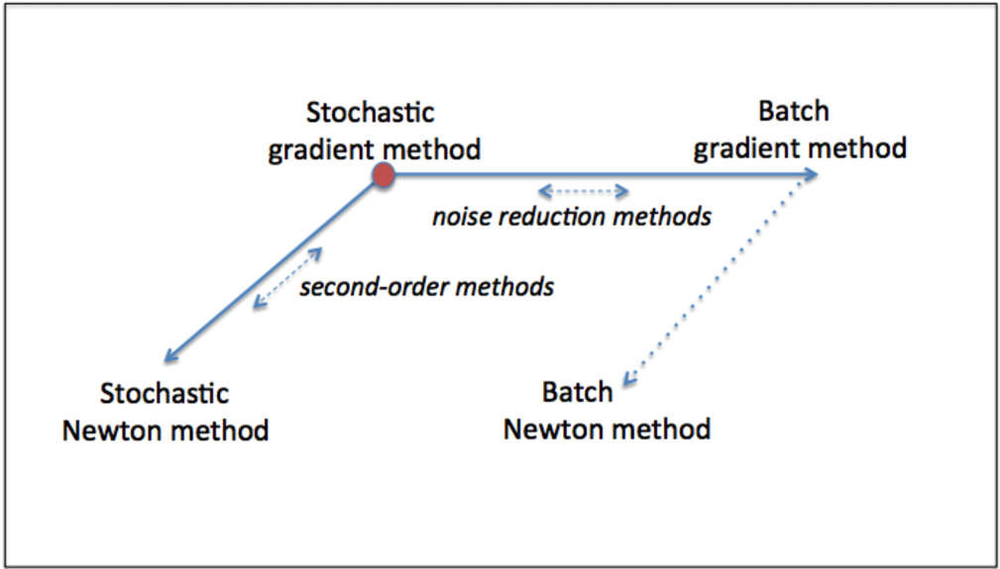

# A Machine Learning Tutorial

---

### The Origin

- [Mathematica](https://www.wolfram.com/mathematica/)[*](https://github.com/utensil/mathematica-notebooks) (2000) 
- [Neural Networks](https://book.douban.com/subject/1115600/) (2002)
- [NuPIC](https://github.com/numenta/nupic) and [NuPIC Core](https://github.com/numenta/nupic.core/pulls?utf8=%E2%9C%93&q=author%3Autensil) (2014)
- [kaggle: Higgs Boson Machine Learning Challenge](https://www.kaggle.com/c/higgs-boson) (2014)
- Dive in (2016)

Note:

- [Robot Movies](https://www.ranker.com/list/best-artificial-intelligence-movies-list/all-genre-movies-lists)
  - http://www.artofthetitle.com/title/eva/
- [Amazing Ants](https://book.douban.com/subject/1044309/) (2002)

Dive in inclues Julia, Geometric Algebra, Keras and Risk Control.

---

## Traditional Machine Learning Methods

Note:

http://detexify.kirelabs.org/classify.html
http://shapecatcher.com/

+++

### The Objective

 <!-- .element: style="background-color: white" -->

`$$ \underset{x \in D}{\operatorname{arg\,min}} \, f(x) := \{x \mid \forall y \in D : f(y) \ge f(x)\} $$`

Note:

- https://en.wikipedia.org/wiki/Arg_max
- [Argmax and Max Calculus](https://www.cs.ubc.ca/~schmidtm/Documents/2016_540_Argmax.pdf) 

+++

#### Generalized Linear Models

`$$ \boldsymbol{y} = X \boldsymbol{w} + \boldsymbol{b} $$`


+++

#### For $p$ features and $n$ samples:

`$$ \left(
  \begin{array}{c}
    y_1 \\
    \vdots \\
    y_n
  \end{array}
\right)
= \left(
  \begin{array}{c}
    \mathbf{x}^\top_1 \\
    \vdots \\
    \mathbf{x}^\top_n
  \end{array}
\right) \left(
  \begin{array}{c}
    w_1 \\
    \vdots \\
    w_p
  \end{array}
\right) + b $$` <!-- .element: class="" style="font-size:smaller" --> 

`$$ \left(
  \begin{array}{c}
    y_1 \\
    \vdots \\
    y_n
  \end{array}
\right)
= \left(
  \begin{array}{cccc}
    1 & x_{11} & \ldots & x_{1p}\\
    1 & \vdots & \ddots & \vdots\\
    1 & x_{n1} & \ldots & x_{np}
  \end{array}
\right) \left(
  \begin{array}{c}
    w_0 \\
    \vdots \\
    w_p
  \end{array}
\right) $$` <!-- .element: class="fragment" style="font-size:smaller" -->

`$$\quad y_i = \beta_0 + \beta x_i + \varepsilon $$`  <!-- .element: class="fragment" style="font-size:smaller" -->

Note:

https://en.wikipedia.org/wiki/Linear_regression

+++

#### Bias trick


Source: [CS231n Convolutional Neural Networks for Visual Recognition: Linear classification](http://cs231n.github.io/linear-classify/)

+++

#### Ordinary Least Squares


`$$ \underset{\boldsymbol{w}}{\operatorname{arg\,min}} {|| X \boldsymbol{w} - \boldsymbol{y}||_2}^2 $$`

Note:

https://image.slidesharecdn.com/simplelinearregressionfinal-121101072438-phpapp02/95/simple-linear-regression-final-8-638.jpg?cb=1507030484

https://www.slideshare.net/harshupadhyay/simple-linear-regression-final?next_slideshow=1

+++

#### Outliers


Source: [Linear regression From Wikipedia](https://en.wikipedia.org/wiki/Linear_regression)

+++

#### Vector Norms

`$$ ||x||_p=(\sum_i |x_i|^p)^{1/p} $$`

+++

#### Typical Vector Norms

- `$\ell_1$`-Norm: `$$ ||x||_1=\sum_i |x_i| $$`
- `$\ell_2$`-Norm: `$$ ||x||_2=\sqrt{\sum_i^{\phantom{n}} |x_i|^2} $$`
- `$\ell_\infty$`-Norm: `$$ ||x||_\infty=\max_i |x_i| $$`

+++

#### Regulations

<!-- .slide: style="font-size:smaller" -->

- Ridge: `$$ \underset{w}{min\,} {{|| X w - y||_2}^2 + \alpha {||w||_2}^2} $$`
- Lasso: `$$ \underset{w}{min\,} { \frac{1}{2n_{samples}} ||X w - y||_2 ^ 2 + \alpha ||w||_1} $$`
- Elastic Net:  `$$ \underset{w}{min\,} { \frac{1}{2n_{samples}} ||X w - y||_2 ^ 2 + \alpha \rho ||w||_1 + \frac{\alpha(1-\rho)}{2} ||w||_2 ^ 2} $$`

+++

#### Feature Selection


MP: Matching Pursuit

Note:

https://www.slideshare.net/ansrivas21/linear-regression-shared

+++

#### Feature Selection


OMP: Orthogonal Matching Pursuit

+++

#### Feature Selection


LARS: Least Angle Regression

Note:

https://www.quora.com/What-is-Least-Angle-Regression-and-when-should-it-be-used

More:

http://docs.pymc.io/notebooks/GLM-robust-with-outlier-detection.html


+++

<!-- .slide: style="font-size:smaller" -->

#### Bayes Regression

`$$ y_i = \beta_0 + \beta x_i + \varepsilon \Leftrightarrow \begin{cases}
  \mu_i =  \beta_0 + \beta x_i \\
  y_i \sim \mathcal{N}(\mu_i, \sigma)
\end{cases}
$$`

`$$
\DeclareMathOperator*{\argmax}{arg\,max} \argmax_{\beta_0,\,\beta,\,\sigma} \prod_{i=1}^n \mathcal{N}(y_i; \beta_0 + \beta x_i, \sigma)
$$`

`$$
\underbrace{f(\beta_0,\beta,\sigma\mid Y,X)}_{\text{Posterior density}  } \propto \underbrace{\prod_{i=1}^n \mathcal{N}(y_i\mid \beta_0 + \beta x_i, \sigma)}_{\text{Likelihood}} \times \underbrace{f_{\beta_0}(\beta_0) \, f_{\beta}(\beta) \, f_{\sigma}(\sigma)}_{\text{Prior density}}
$$`

Note:

you could, for example assume normal distributions parametrized by some hyperparameters, or tt-distribution if you want to assume heavier tails, or uniform distribution if you do not want to make much assumptions.

https://stats.stackexchange.com/a/252608/186362

https://stats200.stanford.edu/Lecture20.pdf

https://en.wikipedia.org/wiki/Conjugate_prior

+++

#### Multiclass Support Vector Machine (SVM)

 <!-- .element: style="height: 340px" -->

`$$
\text{Hinge Loss:}\quad L_i = \sum_{j\neq y_i} \max(0, s_j - s_{y_i} + \Delta)
$$`

Note:

https://www.suchin.co/2017/03/04/The-Support-Vector-Machine/

+++

#### Sigmoid

  <!-- .element: style="height: 300px; background-color: white" -->

`$$ sigmoid(x)=\frac{1}{1+e^{-x}} $$`

Note:

https://isaacchanghau.github.io/2017/05/22/Activation-Functions-in-Artificial-Neural-Networks/

+++

#### Hyperbolic Tangent (tanh)

  <!-- .element: style="height: 300px; background-color: white" -->

`$$ tanh(x)=\frac{1-e^{-2x}}{1+e^{-2x}} $$`

+++

#### Softmax

  <!-- .element: style="height: 300px; background-color: white" -->

`$$ \text{Cross-Entropy Loss:}\quad L_i = -\log\left(\frac{e^{f_{y_i}}}{ \sum\limits_j e^{f_j} }\right)  $$`

+++

#### Sigmoid v.s. Softmax

Sigmoid: two-class logistic regression

`$$
\begin{align}
\Pr(Y_i=0) &= \frac{e^{-\boldsymbol\beta \cdot \mathbf{X}_i}} {1 +e^{-\boldsymbol\beta_0 \cdot \mathbf{X}_i}} \, \\
\Pr(Y_i=1) &= 1 - \Pr(Y_i=0) = \frac{1} {1 +e^{-\boldsymbol\beta \cdot \mathbf{X}_i}}
\end{align}
$$`

Softmax: multiple-class logistic regression

`$$ 
\Pr(Y_i=k) = \frac{e^{\boldsymbol\beta_k \cdot \mathbf{X}_i}} {\sum\limits_{0 \leq c \leq K} {e^{\boldsymbol\beta_c \cdot \mathbf{X}_i}}}
$$`

+++

<!-- .slide: style="font-size:smaller" -->

#### Linear Regression v.s. Logistic Regression


Source: [Gentlest Intro to Tensorflow #4: Logistic Regression](https://medium.com/all-of-us-are-belong-to-machines/gentlest-intro-to-tensorflow-4-logistic-regression-2afd0cabc54) 

+++

#### Linear Regression v.s. Logistic Regression (Cont.)

 

Source: [Gentlest Intro to Tensorflow #4: Logistic Regression](https://medium.com/all-of-us-are-belong-to-machines/gentlest-intro-to-tensorflow-4-logistic-regression-2afd0cabc54) 

+++

#### Coordinate Descent

 <!-- .element: style="height: 300px; background-color: white" -->
`$$
  w_{k+1} \gets w_k - \alpha_k \nabla_{i_k} F(w_k) e_{i_k}
$$`

`$$
  \ \ \text{where}\ \ \nabla_{i_k} F(w_k) := \frac{\partial F}{\partial w^{i_k}}(w_k)
$$` <!-- .element: class="fragment" style="font-size: smaller" -->

Note:

`$$ \underset{w}{\operatorname{arg\,min}} \, F : \mathbb{R}^{d} \to \mathbb{R} $$`

$w^{i_k}$ represents the $i_k$-th element of the parameter vector, and $e_{i_k}$ represents the $i_k$-th coordinate vector for some $i_k \in \{1,\dots,d\}$.  In other words, the solution estimates $w_{k+1}$ and $w_k$ differ only in their $i_k$-th element as a result of a move in the $i_k$-th coordinate from $w_k$.

Image Source: http://hduongtrong.github.io/2015/11/23/coordinate-descent/

+++

#### Gradient Descent (GD)

`$$
\text{Stochastic: }\quad w_{k+1} \gets w_k - \alpha_k \nabla f_{i_k}(w_k)
$$`

`$$
\text{Batch: }\quad  w_{k+1} \gets w_k - \frac{\alpha_k}{n} \sum_{i=1}^n \nabla f_i(w_k)
$$`

+++

#### SGD Example

 

+++

#### SGD Example (Cont.)

 

+++

#### SGD Example: Escape from Saddle Point


Note:

https://nathanbrixius.wordpress.com/2016/07/29/stochastic-and-batch-methods-for-machine-learning/

http://bair.berkeley.edu/blog/2017/08/31/saddle-efficiency/

https://www.slideshare.net/diannepatricia/martin-takac-solving-largescale-machine-learning-problems-in-a-distributed-way

http://andrew.gibiansky.com/blog/machine-learning/hessian-free-optimization/

http://www.cs.toronto.edu/~jmartens/docs/Momentum_Deep.pdf

http://runopti.github.io/blog/2016/07/07/HessianComp/

http://scikit-learn.org/stable/modules/sgd.html

+++

#### Beyond SG: Noise Reduction and Second-Order Methods

 <!-- .element: style="height: 300px" --> [Optimization Methods for Large-Scale Machine Learning](https://arxiv.org/pdf/1606.04838.pdf) <!-- .element: class="figcaption" -->

+++

#### Beyond SG: Noise Reduction and Second-Order Methods

<figure>

<figcaption>Source: [Optimization Methods for Large-Scale Machine Learning](https://arxiv.org/pdf/1606.04838.pdf)</figcaption>
</figure>

+++

<!-- .slide: data-background-iframe="https://distill.pub/2017/momentum/" data-background-interactive -->

+++

### scikit-learn User Guide

http://scikit-learn.org/stable/user_guide.html

+++

<!-- .slide: data-background-iframe="//scikit-learn.org/stable/user_guide.html" data-background-interactive -->

+++

Note:

https://www.zhihu.com/question/26006703
http://www.holehouse.org/mlclass/index.html
https://github.com/jatinshah/ufldl_tutorial

---

### CV

+++

https://github.com/utensil/julia-playground/blob/master/dl/train_captcha.py
https://keras.io/getting-started/faq/#how-can-i-use-keras-with-datasets-that-dont-fit-in-memory
https://github.com/fchollet/keras/issues/7729
https://github.com/fchollet/keras/issues/1711
https://blog.sigopt.com/posts/common-problems-in-hyperparameter-optimization
https://thuijskens.github.io/2016/12/29/bayesian-optimisation/
https://github.com/thuijskens/bayesian-optimization
https://elitedatascience.com/overfitting-in-machine-learning#how-to-prevent
http://dswalter.github.io/blog/overfitting-regularization-hyperparameters/
http://scikit-learn.org/stable/modules/classes.html#module-sklearn.model_selection
https://stackoverflow.com/questions/40854232/keras-scikit-learn-using-fit-generator-with-cross-validation
https://github.com/fchollet/keras/issues/4278#issuecomment-264665803

---

### Why Go Deep? 

- http://slides.com/beamandrew/deep-learning-101#/
- http://donsoft.io/intro-to-deeplearning

---

### Deep Learning - The Straight Dope

http://gluon.mxnet.io/

+++

#### Simple Networks

+++

<!-- .slide: data-background-iframe="//gluon.mxnet.io/chapter02_supervised-learning/linear-regression-scratch.html" data-background-interactive -->

+++

<!-- .slide: data-background-iframe="//gluon.mxnet.io/chapter02_supervised-learning/perceptron.html" data-background-interactive -->

+++

<!-- .slide: data-background-iframe="//gluon.mxnet.io/chapter02_supervised-learning/softmax-regression-scratch.html" data-background-interactive -->

+++

<!-- .slide: data-background-iframe="//gluon.mxnet.io/chapter03_deep-neural-networks/mlp-scratch.html" data-background-interactive -->

+++

#### More than Networks

+++

<!-- .slide: data-background-iframe="//gluon.mxnet.io/chapter02_supervised-learning/regularization-scratch.html" data-background-interactive -->

+++

<!-- .slide: data-background-iframe="//gluon.mxnet.io/chapter02_supervised-learning/environment.html" data-background-interactive -->

+++

<!-- .slide: data-background-iframe="//gluon.mxnet.io/chapter03_deep-neural-networks/mlp-dropout-scratch.html" data-background-interactive -->

+++

<!-- .slide: data-background-iframe="//gluon.mxnet.io/chapter18_variational-methods-and-uncertainty/bayes-by-backprop.html" data-background-interactive -->

+++

<!-- .slide: data-background-iframe="//gluon.mxnet.io/chapter06_optimization/optimization-intro.html" data-background-interactive -->

+++

<!-- .slide: data-background-iframe="//gluon.mxnet.io/chapter06_optimization/gd-sgd-scratch.html" data-background-interactive -->

+++

<!-- .slide: data-background-iframe="//gluon.mxnet.io/chapter06_optimization/momentum-scratch.html" data-background-interactive -->

+++

<!-- .slide: data-background-iframe="//gluon.mxnet.io/chapter06_optimization/adagrad-scratch.html" data-background-interactive -->

+++

<!-- .slide: data-background-iframe="//gluon.mxnet.io/chapter06_optimization/rmsprop-scratch.html" data-background-interactive -->

+++

<!-- .slide: data-background-iframe="//gluon.mxnet.io/chapter06_optimization/rmsprop-scratch.html" data-background-interactive -->

+++

<!-- .slide: data-background-iframe="//gluon.mxnet.io/chapter06_optimization/adam-scratch.html" data-background-interactive -->

+++

<!-- .slide: data-background-iframe="//gluon.mxnet.io/chapter08_computer-vision/fine-tuning.html" data-background-interactive -->

+++

#### Deep Learning Networks

+++

<!-- .slide: data-background-iframe="//gluon.mxnet.io/chapter04_convolutional-neural-networks/cnn-scratch.html" data-background-interactive -->

+++

<!-- .slide: data-background-iframe="//gluon.mxnet.io/chapter04_convolutional-neural-networks/cnn-batch-norm-scratch.html" data-background-interactive -->

+++

<!-- .slide: data-background-iframe="//gluon.mxnet.io/chapter05_recurrent-neural-networks/simple-rnn.html" data-background-interactive -->
+++

<!-- .slide: data-background-iframe="//gluon.mxnet.io/chapter05_recurrent-neural-networks/lstm-scratch.html" data-background-interactive -->

+++

<!-- .slide: data-background-iframe="//gluon.mxnet.io/chapter05_recurrent-neural-networks/gru-scratch.html" data-background-interactive -->

+++

<!-- .slide: data-background-iframe="//gluon.mxnet.io/chapter14_generative-adversarial-networks/gan-intro.html" data-background-interactive -->

+++

<!-- .slide: data-background-iframe="//gluon.mxnet.io/chapter14_generative-adversarial-networks/dcgan.html" data-background-interactive -->

+++

<!-- .slide: data-background-iframe="//gluon.mxnet.io/chapter14_generative-adversarial-networks/pixel2pixel.html" data-background-interactive -->

+++

#### Applications

+++

<!-- .slide: data-background-iframe="//gluon.mxnet.io/chapter08_computer-vision/object-detection.html" data-background-interactive -->

+++

<!-- .slide: data-background-iframe="//gluon.mxnet.io/chapter08_computer-vision/visual-question-answer.html" data-background-interactive -->

---

### Math Foundation

- neuroscience narrative, drawing analogies to biology
- representations narrative, centered on transformations of data and the manifold hypothesis
- probabilistic narrative, which interprets neural networks as finding latent variables
- deep learning studies a connection between optimization and functional programming
  - the representations narrative in deep learning corresponds to type theory in functional programming
- http://colah.github.io/posts/2015-09-NN-Types-FP/

+++

- http://mathworld.wolfram.com/VectorNorm.html
- https://github.com/utensil/utensil.github.io/issues/15

---

### Libs

- https://simplestatistics.org/docs/

---

### DLib


- http://dlib.net/ml.html

---

### Tensorflow

- https://github.com/donnemartin/data-science-ipython-notebooks#tensor-flow-tutorials
- https://github.com/jtoy/awesome-tensorflow
- https://github.com/sjchoi86/Tensorflow-101
- https://github.com/vahidk/EffectiveTensorflow
- https://github.com/nlintz/TensorFlow-Tutorials
- https://github.com/lawlite19/MachineLearning_TensorFlow

---

### Xgboost

- https://xgboost.readthedocs.io/en/latest/model.html
- https://homes.cs.washington.edu/~tqchen/pdf/BoostedTree.pdf
- https://machinelearningmastery.com/gentle-introduction-xgboost-applied-machine-learning/
- http://www.kdd.org/kdd2016/papers/files/rfp0697-chenAemb.pdf

+++

### Higgs Boson

- http://nbviewer.jupyter.org/urls/www.lri.fr/~kegl/HiggsML/StartingKit/startingKitHiggsKegl.ipynb
- https://www.kaggle.com/c/higgs-boson/discussion/13143
- http://opendata.cern.ch/record/329
- http://cs229.stanford.edu/proj2015/017_report.pdf
- http://cs231n.stanford.edu/reports/2016/pdfs/300_Report.pdf
- https://www.researchgate.net/publication/287742463_Searching_for_higgs_boson_decay_modes_with_deep_learning
- https://arxiv.org/pdf/1402.4735.pdf
- https://no2147483647.wordpress.com/2014/09/17/winning-solution-of-kaggle-higgs-competition-what-a-single-model-can-do/

---

### Datasets

- All
  - https://github.com/caesar0301/awesome-public-datasets
  - http://academictorrents.com/
- CV
  - http://deeplearning.net/datasets
- Go
  - https://github.com/yenw/computer-go-dataset
- NLP
  - http://universaldependencies.org/
  - https://github.com/Breakend/DialogDatasets

+++

Notebooks:

- http://scikit-learn.org/dev/_static/ml_map.png
- https://github.com/donnemartin/data-science-ipython-notebooks
- https://github.com/jakevdp/PythonDataScienceHandbook

Foundation:

- https://github.com/rushter/MLAlgorithms/
- https://github.com/eriklindernoren/ML-From-Scratch
- https://github.com/ujjwalkarn/Machine-Learning-Tutorials

+++

- https://en.wikipedia.org/wiki/Arg_max
- https://tex.stackexchange.com/questions/5223/command-for-argmin-or-argmax
- https://en.wikibooks.org/wiki/LaTeX/Advanced_Mathematics
- https://www.cs.ubc.ca/~schmidtm/Documents/2016_540_Argmax.pdf
- https://raw.githubusercontent.com/scikit-learn/scikit-learn/master/doc/modules/linear_model.rst

---

### Visualization

- http://playground.tensorflow.org
- https://deeplearnjs.org/demos/model-builder/
- http://cs.stanford.edu/people/karpathy/convnetjs/
- http://cs231n.github.io/neural-networks-3/
- http://colah.github.io/posts/2014-03-NN-Manifolds-Topology/
- http://colah.github.io/
- https://colah.github.io/posts/2014-07-Understanding-Convolutions/

+++

- http://colah.github.io/posts/2015-09-NN-Types-FP/
- http://colah.github.io/posts/2015-01-Visualizing-Representations/
- http://colah.github.io/posts/2014-07-NLP-RNNs-Representations/
- http://colah.github.io/posts/2014-10-Visualizing-MNIST/
- https://zhuanlan.zhihu.com/p/27204291
- https://blog.jakuba.net/2017/05/30/tensorflow-visualization.html

+++

- https://github.com/ethereon/netscope
- https://www.zhihu.com/question/26006703/answer/135825424
- http://josephpcohen.com/w/visualizing-cnn-architectures-side-by-side-with-mxnet/

+++

http://nbviewer.jupyter.org/github/stephencwelch/Neural-Networks-Demystified/tree/master/
https://www.cs.ox.ac.uk/people/nando.defreitas/machinelearning/
http://www.scipy-lectures.org/intro/numpy/numpy.html#indexing-and-slicing
http://scikit-learn.org/stable/modules/tree.html
https://distill.pub/2017/momentum/
https://github.com/distillpub/post--feature-visualization
https://distill.pub/2017/feature-visualization/
https://bondifrench.github.io/ml-in-js/

---

### Understanding LSTM Networks

- http://colah.github.io/posts/2015-08-Understanding-LSTMs
- https://medium.com/mlreview/understanding-lstm-and-its-diagrams-37e2f46f1714

+++

<!-- #####.slide: data-background-iframe="//colah.github.io/posts/2015-08-Understanding-LSTMs/" data-background-interactive -->


---

APPENDIX

---

### New Links

+++

* https://github.com/karpathy/convnetjs
* http://cs.stanford.edu/people/karpathy/convnetjs/demo/classify2d.html
* http://www.cs.ubc.ca/~van/papers/2016-TOG-deepRL/index.html
* https://github.com/janesjanes/sketchy
* http://scs.ryerson.ca/~aharley/vis/conv/
* http://cs.stanford.edu/people/karpathy/convnetjs/demo/cifar10.html
* https://deepart.io/

+++

* https://www.youtube.com/playlist?list=PLiaHhY2iBX9hdHaRr6b7XevZtgZRa1PoU
* https://www.youtube.com/playlist?list=PLE6Wd9FR--EfW8dtjAuPoTuPcqmOV53Fu
* http://swanintelligence.com/first-steps-with-neural-nets-in-keras.html
* http://neuralnetworksanddeeplearning.com/
* http://www.deeplearningbook.org/
* http://boxcar2d.com/index.html

+++

* https://www.flickr.com/photos/syntopia/6791724773/in/photostream/
* http://blog.hvidtfeldts.net/index.php/2012/01/knots-and-polyhedra/
* http://blog.mathteachersresource.com/?p=670
* http://www.gitxiv.com/
* http://colah.github.io/posts/2014-03-NN-Manifolds-Topology/
* https://github.com/colah/Visualizing-Deep-Learning

+++

* https://distill.pub/2017/feature-visualization/
* https://github.com/ChristosChristofidis/awesome-deep-learning#videos-and-lectures
* https://github.com/guillaume-chevalier/Awesome-Deep-Learning-Resources#youtube
* https://github.com/kjw0612/awesome-deep-vision#videos

+++

https://hackernoon.com/learning-ai-if-you-suck-at-math-p5-deep-learning-and-convolutional-neural-nets-in-plain-english-cda79679bbe3
http://cs231n.github.io/neural-networks-1/
https://www.cs.ox.ac.uk/people/nando.defreitas/machinelearning/
http://cs231n.github.io/convolutional-networks/
http://www.deeplearningbook.org/

+++

https://nbviewer.jupyter.org/github/makeyourownneuralnetwork/makeyourownneuralnetwork/
https://petewarden.com/2016/02/28/tensorflow-for-poets/
http://blog.otoro.net/2017/01/01/recurrent-neural-network-artist/
https://github.com/hardmaru/rnn-tutorial
https://medium.com/emergent-future/simple-reinforcement-learning-with-tensorflow-part-0-q-learning-with-tables-and-neural-networks-d195264329d0
https://medium.freecodecamp.org/if-you-want-to-learn-data-science-start-with-one-of-these-programming-classes-fb694ffe780c

+++

https://www.docker-cn.com/registry-mirror
https://www.daocloud.io/mirror

+++

https://www.mathsisfun.com/algebra/matrix-multiplying.html
https://eli.thegreenplace.net/2015/visualizing-matrix-multiplication-as-a-linear-combination/
https://www.datasciencecentral.com/profiles/blogs/matrix-multiplication-in-neural-networks

+++

https://www.quora.com/What-is-the-best-way-to-multiply-two-matrices-in-C++/answer/Jan-Christian-Meyer
http://arainhyy.github.io/#
http://www.cmsoft.com.br/opencl-tutorial/case-study-matrix-multiplication/
https://www.linkedin.com/pulse/lets-untangle-mesh-accelerate-deep-learning-collective-chien-ping-lu

+++

http://www.cs.uvm.edu/~icdm/algorithms/10Algorithms-08.pdf
https://twitter.com/demografia_csic/status/536576442495410177
https://startupsventurecapital.com/essential-cheat-sheets-for-machine-learning-and-deep-learning-researchers-efb6a8ebd2e5
https://becominghuman.ai/cheat-sheets-for-ai-neural-networks-machine-learning-deep-learning-big-data-678c51b4b463
http://www.asimovinstitute.org/neural-network-zoo/
https://en.wikipedia.org/wiki/Radial_basis_function
http://thinkzone.wlonk.com/
https://i.pinimg.com/originals/90/a1/87/90a187e216dbf0ba03941a63c17cdcb3.png

+++

https://blog.adioma.com/how-to-think-visually-using-visual-analogies-infographic/#_=_
https://medium.com/@shaha/azure-machine-learning-10e0ab2b2c68
https://www.slideshare.net/andrewssobral/machine-learning-for-dummies-without-mathematics
https://www.slideshare.net/aaalm/2016-01-27-a-gentle-and-structured-introduction-to-machine-learning-v105-for-release-58329371
https://docs.microsoft.com/en-us/azure/machine-learning/studio/algorithm-cheat-sheet
https://www.safaribooksonline.com/library/view/deep-learning/9781491924570/ch04.html
https://arxiv.org/pdf/1503.04069.pdf
https://arxiv.org/pdf/1506.00019.pdf
http://proceedings.mlr.press/v37/jozefowicz15.pdf

+++

http://nbviewer.jupyter.org/github/aalind0/GAN-auto-write/blob/master/auto_write.ipynb
http://drorbn.net/AcademicPensieve/About.html

+++

https://github.com/BAILOOL/DoYouEvenLearn

---

### Links


+++

#### ML Top

- [Deep Learning School 2016: Individual Talks](https://www.youtube.com/playlist?list=PLrAXtmErZgOfMuxkACrYnD2fTgbzk2THW)
- [Online Course on Neural Networks](http://info.usherbrooke.ca/hlarochelle/neural_networks/content.html)
- https://github.com/fchollet/keras-resources
- https://github.com/lamblin/bayareadlschool
- http://deeplearning.net/datasets

+++

- [Deep Learning Summer School, Montreal 2016](https://www.youtube.com/playlist?list=PL5bqIc6XopCbb-FvnHmD1neVlQKwGzQyR)
- [Unsupervised Feature Learning and Deep Learning](http://ufldl.stanford.edu/wiki/index.php/Main_Page)
- [CS224d: Deep Learning for Natural Language Processing](http://cs224d.stanford.edu/)
- [ CS231n: Convolutional Neural Networks for Visual Recognition](http://cs231n.github.io/)
- https://github.com/baidu-research/ba-dls-deepspeech
- https://github.com/tiny-dnn/tiny-dnn
- https://github.com/dennybritz/reinforcement-learning

+++

- https://github.com/Tetrachrome/subpixel
- https://github.com/mxgmn/WaveFunctionCollapse
- https://github.com/SullyChen/Nvidia-Autopilot-TensorFlow
- https://github.com/thoughtfulml/examples-in-python
- http://statweb.stanford.edu/~tibs/ElemStatLearn/
- https://github.com/johnmyleswhite/ML_for_Hackers
- http://lamda.nju.edu.cn/weixs/project/CNNTricks/CNNTricks.html

+++

- https://github.com/ZuzooVn/machine-learning-for-software-engineers
- https://github.com/rushter/MLAlgorithms
- http://www.scipy-lectures.org/advanced/image_processing/index.html
- https://zhuanlan.zhihu.com/p/22129946
- http://conflict.lshtm.ac.uk/index.htm
- https://arxiv.org/abs/1404.7828

+++

- http://www.jeremydjacksonphd.com/category/deep-learning/
- http://distill.pub/2016/misread-tsne/
- http://playground.tensorflow.org/
- http://projector.tensorflow.org/
- http://ai.berkeley.edu/home.html
- https://en.wikipedia.org/wiki/Topological_data_analysis
- https://www.youtube.com/subscription_manager
- http://rll.berkeley.edu/deeprlcourse/#syllabus ( https://zhuanlan.zhihu.com/p/24721292 )
- https://deepmind.com/blog/wavenet-generative-model-raw-audio/

+++

- https://github.com/tensorflow/magenta/blob/master/magenta/reviews/pixelrnn.md
- https://gist.github.com/shagunsodhani/e741ebd5ba0e0fc0f49d7836e30891a7
- https://deepmind.com/blog/differentiable-neural-computers/
- https://deepmind.com/blog/deepmind-round-up-2016/
- https://github.com/phreeza/keras-GAN
- https://github.com/dustinvtran/ml-videos
- https://github.com/oxford-cs-deepnlp-2017/lectures
- https://github.com/rhnvrm/universe-coaster-racer-challenge
- https://github.com/random-forests/tutorials

+++

- [Machine Learning Recipes with Josh Gordon](https://www.youtube.com/playlist?list=PLOU2XLYxmsIIuiBfYad6rFYQU_jL2ryal)
- [Reinforcement Learning: An Introduction ](http://webdocs.cs.ualberta.ca/~sutton/book/ebook/the-book.html)
- https://github.com/eriklindernoren/ML-From-Scratch
- https://github.com/stanfordnlp/cs224n-winter17-notes
- https://medium.com/@ageitgey/machine-learning-is-fun-part-4-modern-face-recognition-with-deep-learning-c3cffc121d78#.7tyqpjz6q

+++

#### ML

- [【从零单排——数学白痴也能玩机器学习】](https://zhuanlan.zhihu.com/p/19946913)
- [深度学习入门必看的书和论文？有哪些必备的技能需学习？](http://www.zhihu.com/question/31785984)
- [机器视觉、图像处理、机器学习领域相关代码和工程项目和数据集 集合](https://zhuanlan.zhihu.com/p/20787086)
- [CNN(卷积神经网络)、RNN(循环神经网络)、DNN(深度神经网络)的内部网络结构有什么区别？](https://www.zhihu.com/question/34681168)
- [简单解释一下sparse autoencoder, sparse coding和restricted boltzmann machine的关系？](https://www.zhihu.com/question/22906027)
- [在 Deep Learning / Machine Learning 领域，C++ 应如何学习？](https://www.zhihu.com/question/41816315)

+++

- [C++ neural network library](https://github.com/clab/cnn)
- [theano](http://www.deeplearning.net/software/theano/)
- [TensorFlow](https://github.com/tensorflow/tensorflow)
- [torch7](https://github.com/torch/torch7)
- [EXPLAINING AND HARNESSING ADVERSARIAL EXAMPLES](https://arxiv.org/pdf/1412.6572.pdf) and [
  The Flaw Lurking In Every Deep Neural Net](http://www.i-programmer.info/news/105-artificial-intelligence/7352-the-flaw-lurking-in-every-deep-neural-net.html)

+++

- https://github.com/rasbt/python-machine-learning-book
- https://github.com/terryum/awesome-deep-learning-papers
- https://github.com/sjchoi86/dl_tutorials
- http://mp.weixin.qq.com/s?__biz=MzA3MTU0MzcyMQ==&mid=2447602671&idx=1&sn=700ffa7c1a01daa9b5550cc173609925&scene=1&
- https://zhuanlan.zhihu.com/p/22308032
- https://zhuanlan.zhihu.com/p/22107715
- https://www.quora.com/What-are-the-best-resources-to-learn-about-deep-learning

+++

#### NLP

- [A Convolutional Neural Network for Modelling Sentences](http://arxiv.org/abs/1404.2188)
- [基于深度学习的自然语言处理在2016年有哪些值得期待的发展？](https://www.zhihu.com/question/40489869)
- [一个玩得停不下来的Google神器：Ngram](https://zhuanlan.zhihu.com/p/20165483)
- [如何评价SyntaxNet？](https://www.zhihu.com/question/46272554)

+++

#### CV

- [学习了哪些知识，计算机视觉才算入门？](https://www.zhihu.com/question/26836846)
- [CS231n课程笔记翻译：图像分类笔记](https://zhuanlan.zhihu.com/p/20894041)
- [学习SLAM需要哪些预备知识？](https://www.zhihu.com/question/35186064)

+++

Others:
- https://github.com/vic317yeh/One-Click-to-Be-Pro
- https://github.com/geekan/one-python
- https://zhuanlan.zhihu.com/p/22308870
- https://zhuanlan.zhihu.com/p/20092285
- https://zhuanlan.zhihu.com/p/22126107

+++

- https://github.com/Kivy-CN/Duke-STA-663-CN
- https://github.com/Kivy-CN/ml-for-humans-zh
- https://github.com/Kivy-CN/Stanford-CS-229-CN
- https://github.com/CuprousIodide/Poinchinski-Memories
- https://foolbox.readthedocs.io/en/latest/user/examples.html
- https://hub.docker.com/r/utensil/dl/

+++

- https://github.com/utensil/utensil.github.io/issues/83
- [My Jupyter Notebooks about ML](https://nbviewer.jupyter.org/github/utensil/julia-playground/tree/master/dl/)

---

### Nupic

+++

Videos

TODO

+++

Papers:

- [Continuous online sequence learning with an unsupervised neural network model](http://arxiv.org/abs/1512.05463)
- [Search for the right paper about HTM](https://discourse.numenta.org/t/search-for-the-right-paper-about-htm/274)

+++

Algorithm

- [Spatial Pooler Algorithm Implementation and Pseudocode](http://numenta.com/assets/pdf/biological-and-machine-intelligence/0.4/BaMI-Spatial-Pooler.pdf)
- [Temporal Memory Algorithm Implementation and Pseudocode](http://numenta.com/assets/pdf/biological-and-machine-intelligence/0.4/BaMI-Temporal-Memory.pdf)
- [HTM CLA Flow Chart Diagrams](https://discourse.numenta.org/t/htm-cla-flow-chart-diagrams/713)

+++

Implementations

- [NuPIC](https://github.com/numenta/nupic) [<i class="fa fa-code-fork"></i>](https://github.com/numenta/nupic/pulls?utf8=%E2%9C%93&q=author%3Autensil)
- [NuPIC Core](https://github.com/numenta/nupic.core) [<i class="fa fa-code-fork"></i>](https://github.com/numenta/nupic.core/pulls?utf8=%E2%9C%93&q=author%3Autensil)
- [HTM.Julia](https://github.com/htm-community/HTM.Julia)
- [Bare-Bone HTM](http://ifni.co/bbHTM.html)

---

### Further

+++

- [Capsule Networks (CapsNets) – Tutorial](https://www.youtube.com/watch?v=pPN8d0E3900&index=14&list=PLKUPUQTsIILCRLQvILCL-VCsg5x3zQiTU)

---

### TensorFlow Exercises

<small>focusing on the comparison with NumPy</small>

https://github.com/Kyubyong/tensorflow-exercises

+++

<!-- .slide: data-background-iframe="https://nbviewer.jupyter.org/github/Kyubyong/tensorflow-exercises/blob/master/Constants_Sequences_and_Random_Values_Solutions.ipynb" data-background-interactive -->

+++

<!-- .slide: data-background-iframe="https://nbviewer.jupyter.org/github/Kyubyong/tensorflow-exercises/blob/master/Graph_Solutions.ipynb" data-background-interactive -->

+++

<!-- .slide: data-background-iframe="https://nbviewer.jupyter.org/github/Kyubyong/tensorflow-exercises/blob/master/Variables_Solutions.ipynb" data-background-interactive -->

+++

<!-- .slide: data-background-iframe="https://nbviewer.jupyter.org/github/Kyubyong/tensorflow-exercises/blob/master/Reading_Data_Solutions.ipynb" data-background-interactive -->

+++

<!-- .slide: data-background-iframe="https://nbviewer.jupyter.org/github/Kyubyong/tensorflow-exercises/blob/master/Tensor_Transformations_Solutions.ipynb" data-background-interactive -->

+++

<!-- .slide: data-background-iframe="https://nbviewer.jupyter.org/github/Kyubyong/tensorflow-exercises/blob/master/Math_Part1_Solutions.ipynb" data-background-interactive -->

+++

<!-- .slide: data-background-iframe="https://nbviewer.jupyter.org/github/Kyubyong/tensorflow-exercises/blob/master/Math_Part2_Solutions.ipynb" data-background-interactive -->

+++

<!-- .slide: data-background-iframe="https://nbviewer.jupyter.org/github/Kyubyong/tensorflow-exercises/blob/master/Math_Part3_Solutions.ipynb" data-background-interactive -->

+++

<!-- .slide: data-background-iframe="https://nbviewer.jupyter.org/github/Kyubyong/tensorflow-exercises/blob/master/Control_Flow_Solutions.ipynb" data-background-interactive -->

+++

<!-- .slide: data-background-iframe="https://nbviewer.jupyter.org/github/Kyubyong/tensorflow-exercises/blob/master/Sparse_Tensors-Solutions.ipynb" data-background-interactive -->

+++

<!-- .slide: data-background-iframe="https://nbviewer.jupyter.org/github/Kyubyong/tensorflow-exercises/blob/master/Neural_Network_Part1_Solutions.ipynb" data-background-interactive -->

+++

<!-- .slide: data-background-iframe="https://nbviewer.jupyter.org/github/Kyubyong/tensorflow-exercises/blob/master/Neural_Network_Part2_Solutions.ipynb" data-background-interactive -->

+++

<!-- .slide: data-background-iframe="https://nbviewer.jupyter.org/github/Kyubyong/tensorflow-exercises/blob/master/Seq2Seq_solutions.ipynb" data-background-interactive -->

+++

<!-- .slide: data-background-iframe="https://nbviewer.jupyter.org/github/Kyubyong/tensorflow-exercises/blob/master/Audio_Processing.ipynb" data-background-interactive -->

---

### TensorFlow Tutorial

<small>used by Nvidia</small>

https://github.com/alrojo/tensorflow-tutorial

+++

<!-- .slide: data-background-iframe="//nbviewer.jupyter.org/github/alrojo/tensorflow-tutorial/blob/master/lab1_FFN/lab1_FFN.ipynb" data-background-interactive -->

+++

<!-- .slide: data-background-iframe="//nbviewer.jupyter.org/github/alrojo/tensorflow-tutorial/blob/master/lab2_CNN/lab2_CNN.ipynb" data-background-interactive -->

+++

<!-- .slide: data-background-iframe="//nbviewer.jupyter.org/github/alrojo/tensorflow-tutorial/blob/master/lab3_RNN/lab3_RNN.ipynb" data-background-interactive -->

+++

<!-- .slide: data-background-iframe="//nbviewer.jupyter.org/github/alrojo/tensorflow-tutorial/blob/master/lab4_Kaggle/lab4_Kaggle.ipynb" data-background-interactive -->

+++

<!-- .slide: data-background-iframe="//nbviewer.jupyter.org/github/alrojo/tensorflow-tutorial/blob/master/lab5_AE/lab5_AE.ipynb" data-background-interactive -->

---

### Draft

+++

```python
from time import localtime
 
activities = {8: 'Sleeping', 9: 'Commuting', 17: 'Working',
              18: 'Commuting', 20: 'Eating', 22: 'Resting' }
 
time_now = localtime()
hour = time_now.tm_hour
 
for activity_time in sorted(activities.keys()):
    if hour < activity_time:
        print activities[activity_time]
        break
else:
    print 'Unknown, AFK or sleeping!'
```

+++

```python
from time import localtime
 
activities = {8: 'Sleeping', 9: 'Commuting', 17: 'Working',
              18: 'Commuting', 20: 'Eating', 22: 'Resting' }
 
time_now = localtime()
hour = time_now.tm_hour
 
for activity_time in sorted(activities.keys()):
    if hour < activity_time:
        print activities[activity_time]
        break
else:
    print 'Unknown, AFK or sleeping!'
```

<p class="fragment current-only" data-code-focus="1">
  comment 1
</p>
<p class="fragment current-only" data-code-focus="3-4">
  comment 2
</p>
<p class="fragment current-only" data-code-focus="9-14">
  comment 3
</p>

+++

<!-- .slide: data-background-iframe="https://www.youtube.com/embed/gn4nRCC9TwQ" data-background-interactive -->

+++

<!-- .slide: data-background-video="https://s3.amazonaws.com/static.slid.es/site/homepage/v1/homepage-video-editor.mp4" -->

+++

<table style="width: 80%; overflow-y: scroll">
  <tr>
    <th>Firstname</th>
    <th>Lastname</th> 
    <th>Age</th>
  </tr>
  <tr>
    <td>Generalized Linear Models</td>
    <td>$ \boldsymbol{\hat{y}} = X \boldsymbol{w} + b $</td>
    <td>25</td>
  </tr>
  <tr class="fragment">
    <td>Elastic Net</td>
    <td>$ \underset{w}{min\,} { \frac{1}{2n_{samples}} ||X w - y||_2 ^ 2 + \alpha \rho ||w||_1 + \frac{\alpha(1-\rho)}{2} ||w||_2 ^ 2} $</td>
    <td>94</td>
  </tr>
  <tr class="fragment">
    <td>John</td>
    <td>Doe</td>
    <td>43</td>
  </tr>
</table>


