# A Machine Learning Tutorial

Utensil Song @ 2017-2018

---

### The Origin

***

#### [Wolfram Mathematic](https://www.wolfram.com/mathematica/)  (2000) 


- [My Mathematica Notebooks](https://github.com/utensil/mathematica-notebooks)
  - [DSolve](http://reference.wolfram.com/language/ref/DSolve.html) / [PhysicalSystemData](http://reference.wolfram.com/language/ref/PhysicalSystemData.html) / [Fit](http://reference.wolfram.com/language/ref/Fit.html)
- [Wolfram Alpha Step-by-step Solutions](http://www.wolframalpha.com/examples/pro-features/step-by-step-solutions/)

***

#### First Book on Neural Networks (2002)

[ <!-- .element class="img-450" -->](https://book.douban.com/subject/1115600/)

***

#### [NuPIC](https://github.com/numenta/nupic)[*](https://github.com/numenta/nupic.core/pulls?utf8=%E2%9C%93&q=author%3Autensil)[*](https://github.com/numenta/htm.java/pulls?utf8=%E2%9C%93&q=author%3Autensil) (2014)

- Sparse distributed representations
- Encoders
- Spatial Pooling
- Hierarchical Temporal Memory

note:

- [Biological and Machine Intelligence (BAMI)](https://numenta.com/resources/biological-and-machine-intelligence/)
- [HTM Studio](https://numenta.com/machine-intelligence-technology/htm-studio/)

***

#### [kaggle: Higgs Boson Machine Learning Challenge](https://www.kaggle.com/c/higgs-boson) (2014)

***

<!-- .slide: data-background-image="http://donsoft.io/intro-to-deeplearning/images/large_hadron_collider.jpg" data-background-interactive style="font-size: 60px"-->

Large Hadron Collider <!-- .element class="fragment" -->

***

<!-- .slide: data-background-image="http://donsoft.io/intro-to-deeplearning/images/higgs_boson.jpg" data-background-interactive style="font-size: 60px"-->

Higgs Boson Detection <!-- .element class="fragment" -->

***

#### Dive in (2016)

Note:

- [Robot Movies](https://www.ranker.com/list/best-artificial-intelligence-movies-list/all-genre-movies-lists)
  - http://www.artofthetitle.com/title/eva/
- [A SiFi novel about a boy and an android](https://book.douban.com/subject/3986607/) (2000)
- [Amazing Ants](https://book.douban.com/subject/1044309/) (2002)

Dive in inclues Julia, Geometric Algebra, Keras and Risk Control.

---

### Overview

***

#### Three Types of Machine Learning

 [Python Machine Learning: Chapter 1 by Sebastian Raschka](http://nbviewer.jupyter.org/github/rasbt/python-machine-learning-book/blob/master/code/ch01/ch01.ipynb)  <!-- .element: class="figcaption" -->

Note:

| Supervised Learning | Unsupervised Learning | Reinforcement Learning |
|---------------------|-----------------------|------------------------|
|  |  | 

[Python Machine Learning: Chapter 1 by Sebastian Raschka](http://nbviewer.jupyter.org/github/rasbt/python-machine-learning-book/blob/master/code/ch01/ch01.ipynb)  <!-- .element: class="figcaption" -->

***

#### Supervised Learning

 [Python Machine Learning: Chapter 1 by Sebastian Raschka](http://nbviewer.jupyter.org/github/rasbt/python-machine-learning-book/blob/master/code/ch01/ch01.ipynb)  <!-- .element: class="figcaption" -->

***

#### Supervised Learning (Cont.)

| Classification | Regression |
|---------------------|-----------------------|
|   <!-- .element: class="img-300" -->  |   <!-- .element: class="img-300" --> |

[Python Machine Learning: Chapter 1 by Sebastian Raschka](http://nbviewer.jupyter.org/github/rasbt/python-machine-learning-book/blob/master/code/ch01/ch01.ipynb)  <!-- .element: class="figcaption" -->

***

#### Unsupervised Learning

| Clustering | Dimensionality Reduction |
|---------------------|-----------------------|
|   <!-- .element: class="img-300" -->  |   <!-- .element: class="img-300" --> |

[Python Machine Learning: Chapter 1 by Sebastian Raschka](http://nbviewer.jupyter.org/github/rasbt/python-machine-learning-book/blob/master/code/ch01/ch01.ipynb)  <!-- .element: class="figcaption" -->

Note:

http://scikit-learn.org/stable/auto_examples/cluster/plot_cluster_comparison.html

***

#### Reinforcement Learning


[Python Machine Learning: Chapter 1 by Sebastian Raschka](http://nbviewer.jupyter.org/github/rasbt/python-machine-learning-book/blob/master/code/ch01/ch01.ipynb)  <!-- .element: class="figcaption" -->

***

<!-- .slide: data-background-iframe="https://www.youtube.com/embed/gn4nRCC9TwQ" data-background-interactive -->

***

#### A roadmap for building machine learning systems


 [Python Machine Learning: Chapter 1 by Sebastian Raschka](http://nbviewer.jupyter.org/github/rasbt/python-machine-learning-book/blob/master/code/ch01/ch01.ipynb)  <!-- .element: class="figcaption" -->

---

### Basic Concepts in Data Science

***

#### What is Data Science?

   <!-- .element: class="img-500" --> [DATA SCIENCE & SCIENTISTS](https://science2knowledge.wordpress.com/data-science-scientists/)   <!-- .element: class="figcaption" -->

***

#### Epicycles of Analysis <!-- .element: style="font-size: 42px" -->

   <!-- .element: class="img-550" -->  [DATA SCIENCE & SCIENTISTS](https://science2knowledge.wordpress.com/data-science-scientists/)   <!-- .element: class="figcaption" -->

Note:

- Stating and refining the question
- Exploring the data
- Building formal statistical models
- Interpreting the results
- Communicating the results

https://gohighbrow.com/the-data-analysis-epicycle/
https://bookdown.org/rdpeng/artofdatascience/epicycle-of-analysis.html

 [The Data Analysis Epicycle](https://gohighbrow.com/the-data-analysis-epicycle/)  <!-- .element: class="figcaption" -->

***

#### Six Types of Analyses

- Descriptive
- Exploratory
- Inferential
- Predictive
- Causal
- Mechanistic

<div style="float: right;width: 70%;">
[Course Introduction - Advanced Data Science by Jeff Leek](http://jtleek.com/advdatasci/slides/01-introduction-slides.html#38)  <!-- .element: class="figcaption" -->
<iframe src="http://jtleek.com/advdatasci/slides/01-introduction-slides.html#38" />
</div>

Note:

https://bookdown.org/rdpeng/artofdatascience/types-of-questions.html
https://datascientistinsights.com/2013/01/29/six-types-of-analyses-every-data-scientist-should-know/
https://www.coursera.org/specializations/jhu-data-science
https://www.pinterest.com.au/pin/572520171368225895/
http://www.caperay.com/blog/index.php/2015/ask-the-right-questions/

***

<!-- .slide: style="font-size: 14px" -->

#### Confusion Matrix <!-- .element: style="font-size: 42px" -->

<table class="wikitable" align="center" style="text-align:center; border:none; background:transparent;color: black">
<tbody><tr>
<td style="border:none;" colspan="2"></td>
<td style="background:#eeeebb;" colspan="2"><b>True condition</b></td>
</tr>
<tr>
<td style="border:none;"></td>
<td style="background:#dddddd;"><a href="https://en.wikipedia.org/wiki/Statistical_population" title="Statistical population">Total population</a></td>
<td style="background:#ffffcc;">Condition positive</td>
<td style="background:#ddddaa;">Condition negative</td>
<td style="background:#eeeecc;font-size:90%;"><a href="https://en.wikipedia.org/wiki//Prevalence" title="Prevalence">Prevalence</a> <span style="font-size:118%;white-space:nowrap;">= <span class="sfrac nowrap" style="display:inline-block; vertical-align:-0.5em; font-size:85%; text-align:center;"><span style="display:block; line-height:1em; margin:0 0.1em;">Σ&nbsp;Condition positive</span><span style="display:block; line-height:1em; margin:0 0.1em; border-top:1px solid;">Σ&nbsp;Total population</span></span></span></td>
<td style="background:#cceecc;border-left:double silver;font-size:90%;" colspan="2"><a href="https://en.wikipedia.org/wiki/Accuracy_and_precision" title="Accuracy and precision">Accuracy</a> (ACC) = <span style="font-size:118%;"><span class="sfrac nowrap" style="display:inline-block; vertical-align:-0.5em; font-size:85%; text-align:center;"><span style="display:block; line-height:1em; margin:0 0.1em;">Σ&nbsp;True positive + Σ True negative</span><span style="display:block; line-height:1em; margin:0 0.1em; border-top:1px solid;">Σ&nbsp;Total population</span></span></span></td>
</tr>
<tr>
<td style="background:#bbeeee;" rowspan="2"><b>Predicted<br>
condition</b></td>
<td style="background:#ccffff;">Predicted condition<br>
positive</td>
<td style="background:#ccffcc;"><span style="color:#006600;"><b><a href="https://en.wikipedia.org/wiki/True_positive" class="mw-redirect" title="True positive">True positive</a></b>,<br>
<a href="https://en.wikipedia.org/wiki/Statistical_power" title="Statistical power">Power</a></span></td>
<td style="background:#eedddd;"><span style="color:#cc0000;"><b><a href="https://en.wikipedia.org/wiki/False_positive" class="mw-redirect" title="False positive">False positive</a></b>,<br>
<a href="https://en.wikipedia.org/wiki/Type_I_error" class="mw-redirect" title="Type I error">Type I error</a></span></td>
<td style="background:#ccffee;border-top:double silver;font-size:90%;"><a href="https://en.wikipedia.org/wiki/Positive_predictive_value" class="mw-redirect" title="Positive predictive value">Positive predictive value</a> (PPV), <a href="https://en.wikipedia.org/wiki/Precision_(information_retrieval)" class="mw-redirect" title="Precision (information retrieval)">Precision</a> = <span style="font-size:118%;white-space:nowrap;"><span class="sfrac nowrap" style="display:inline-block; vertical-align:-0.5em; font-size:85%; text-align:center;"><span style="display:block; line-height:1em; margin:0 0.1em;">Σ True positive</span><span style="display:block; line-height:1em; margin:0 0.1em; border-top:1px solid;">Σ&nbsp;Predicted&nbsp;condition&nbsp;positive</span></span></span></td>
<td style="background:#cceeff;border-top:double silver;font-size:90%;" colspan="2"><a href="https://en.wikipedia.org/wiki/False_discovery_rate" title="False discovery rate">False discovery rate</a> (FDR) = <span style="font-size:118%;white-space:nowrap;"><span class="sfrac nowrap" style="display:inline-block; vertical-align:-0.5em; font-size:85%; text-align:center;"><span style="display:block; line-height:1em; margin:0 0.1em;">Σ False positive</span><span style="display:block; line-height:1em; margin:0 0.1em; border-top:1px solid;">Σ&nbsp;Predicted&nbsp;condition&nbsp;positive</span></span></span></td>
</tr>
<tr>
<td style="background:#aadddd;">Predicted condition<br>
negative</td>
<td style="background:#ffdddd;"><span style="color:#cc0000;"><b><a href="https://en.wikipedia.org/wiki/False_negative" class="mw-redirect" title="False negative">False negative</a></b>,<br>
<a href="https://en.wikipedia.org/wiki/Type_II_error" class="mw-redirect" title="Type II error">Type II error</a></span></td>
<td style="background:#bbeebb;"><span style="color:#006600;"><b><a href="https://en.wikipedia.org/wiki/True_negative" class="mw-redirect" title="True negative">True negative</a></b></span></td>
<td style="background:#eeddee;border-bottom:double silver;font-size:90%;"><a href="https://en.wikipedia.org/wiki/False_omission_rate" class="mw-redirect" title="False omission rate">False omission rate</a> (FOR) = <span style="font-size:118%;white-space:nowrap;"><span class="sfrac nowrap" style="display:inline-block; vertical-align:-0.5em; font-size:85%; text-align:center;"><span style="display:block; line-height:1em; margin:0 0.1em;">Σ False negative</span><span style="display:block; line-height:1em; margin:0 0.1em; border-top:1px solid;">Σ&nbsp;Predicted&nbsp;condition&nbsp;negative</span></span></span></td>
<td style="background:#aaddcc;border-bottom:double silver;font-size:90%;" colspan="2"><a href="https://en.wikipedia.org/wiki/Negative_predictive_value" class="mw-redirect" title="Negative predictive value">Negative predictive value</a> (NPV) = <span style="font-size:118%;white-space:nowrap;"><span class="sfrac nowrap" style="display:inline-block; vertical-align:-0.5em; font-size:85%; text-align:center;"><span style="display:block; line-height:1em; margin:0 0.1em;">Σ True negative</span><span style="display:block; line-height:1em; margin:0 0.1em; border-top:1px solid;">Σ&nbsp;Predicted&nbsp;condition&nbsp;negative</span></span></span></td>
</tr>
<tr style="font-size:90%;">
<td style="border:none;vertical-align:bottom;padding:0 2px 0 0;color:#999999;" colspan="2" rowspan="2">Click thumbnail for interactive chart:
<div class="noresize" style="height: 105px; width: 210px; "><a href="http://upload.wikimedia.org/wikipedia/commons/0/0e/DiagnosticTesting_Diagram.svg" class="plainlinks" rel="nofollow" title="Click for interactive SVG chart"></a>
</div>
</td>
<td style="background:#eeffcc;"><a href="https://en.wikipedia.org/wiki/True_positive_rate" class="mw-redirect" title="True positive rate">True positive rate</a> (TPR), <a href="https://en.wikipedia.org/wiki/Recall_(information_retrieval)" class="mw-redirect" title="Recall (information retrieval)">Recall</a>, <a href="https://en.wikipedia.org/wiki/Sensitivity_(tests)" class="mw-redirect" title="Sensitivity (tests)">Sensitivity</a>, probability&nbsp;of&nbsp;detection <span style="font-size:118%;white-space:nowrap;">= <span class="sfrac nowrap" style="display:inline-block; vertical-align:-0.5em; font-size:85%; text-align:center;"><span style="display:block; line-height:1em; margin:0 0.1em;">Σ True positive</span><span style="display:block; line-height:1em; margin:0 0.1em; margin-bottom: 0.4em;border-top:1px solid;">Σ&nbsp;Condition&nbsp;positive</span></span></span></td>
<td style="background:#eeddbb;"><a href="https://en.wikipedia.org/wiki/False_positive_rate" title="False positive rate">False positive rate</a> (FPR), <a href="https://en.wikipedia.org/wiki/Information_retrieval" title="Information retrieval"><span class="nowrap">Fall-out</span></a>, probability&nbsp;of&nbsp;false&nbsp;alarm <span style="font-size:118%;white-space:nowrap;">= <span class="sfrac nowrap" style="display:inline-block; vertical-align:-0.5em; font-size:85%; text-align:center;"><span style="display:block; line-height:1em; margin:0 0.1em;">Σ False positive</span><span style="display:block; line-height:1em; margin:0 0.1em; border-top:1px solid;">Σ&nbsp;Condition&nbsp;negative</span></span></span></td>
<td style="background:#eeeeee;"><a href="https://en.wikipedia.org/wiki/Positive_likelihood_ratio" class="mw-redirect" title="Positive likelihood ratio">Positive likelihood ratio</a> <span class="nowrap">(LR+)</span> <span style="font-size:118%;white-space:nowrap;">= <span class="sfrac nowrap" style="display:inline-block; vertical-align:-0.5em; font-size:85%; text-align:center;"><span style="display:block; line-height:1em; margin:0 0.1em;">TPR</span><span style="display:block; line-height:1em; margin:0 0.1em; border-top:1px solid;">FPR</span></span></span></td>
<td style="background:#dddddd;" rowspan="2"><a href="https://en.wikipedia.org/wiki/Diagnostic_odds_ratio" title="Diagnostic odds ratio">Diagnostic odds ratio</a> (DOR) <span style="font-size:118%;white-space:nowrap;">= <span class="sfrac nowrap" style="display:inline-block; vertical-align:-0.5em; font-size:85%; text-align:center;"><span style="display:block; line-height:1em; margin:0 0.1em;">LR+</span><span style="display:block; line-height:1em; margin:0 0.1em; border-top:1px solid;">LR−</span></span></span></td>
<td style="background:#ddffdd;border-left:double silver;line-height:2;" rowspan="2"><a href="https://en.wikipedia.org/wiki/F1_score" title="F1 score">F<sub>1</sub> score</a> = <span style="font-size:118%;white-space:nowrap;"><span class="sfrac nowrap" style="display:inline-block; vertical-align:-0.5em; font-size:85%; text-align:center;"><span style="display:block; line-height:1em; margin:0 0.1em;">2</span><span style="display:block; line-height:1em; margin:0 0.1em; border-top:1px solid;"><span class="sfrac nowrap" style="display:inline-block; vertical-align:-0.5em; font-size:85%; text-align:center;"><span style="display:block; line-height:1em; margin:0 0.1em;">1</span><span style="display:block; line-height:1em; margin:0 0.1em; border-top:1px solid;">Recall</span></span>&nbsp;+&nbsp;<span class="sfrac nowrap" style="display:inline-block; vertical-align:-0.5em; font-size:85%; text-align:center;"><span style="display:block; line-height:1em; margin:0 0.1em;">1</span><span style="display:block; line-height:1em; margin:0 0.1em; border-top:1px solid;">Precision</span></span></span></span></span></td>
</tr>
<tr style="font-size:90%;">
<td style="background:#ffeecc;"><a href="https://en.wikipedia.org/wiki/False_negative_rate" class="mw-redirect" title="False negative rate">False negative rate</a> (FNR), Miss&nbsp;rate <span style="font-size:118%;white-space:nowrap;">= <span class="sfrac nowrap" style="display:inline-block; vertical-align:-0.5em; font-size:85%; text-align:center;"><span style="display:block; line-height:1em; margin:0 0.1em;">Σ False negative</span><span style="display:block; line-height:1em; margin:0 0.1em; border-top:1px solid;">Σ&nbsp;Condition&nbsp;positive</span></span></span></td>
<td style="background:#ddeebb;"><a href="https://en.wikipedia.org/wiki/True_negative_rate" class="mw-redirect" title="True negative rate">True negative rate</a> (TNR), <a href="https://en.wikipedia.org/wiki/Specificity_(tests)" class="mw-redirect" title="Specificity (tests)">Specificity</a> (SPC) <span style="font-size:118%;white-space:nowrap;">= <span class="sfrac nowrap" style="display:inline-block; vertical-align:-0.5em; font-size:85%; text-align:center;"><span style="display:block; line-height:1em; margin:0 0.1em;">Σ True negative</span><span style="display:block; line-height:1em; margin:0 0.1em; border-top:1px solid;">Σ&nbsp;Condition&nbsp;negative</span></span></span></td>
<td style="background:#cccccc;"><a href="https://en.wikipedia.org/wiki/Negative_likelihood_ratio" class="mw-redirect" title="Negative likelihood ratio">Negative likelihood ratio</a> <span class="nowrap">(LR−)</span> <span style="font-size:118%;white-space:nowrap;">= <span class="sfrac nowrap" style="display:inline-block; vertical-align:-0.5em; font-size:85%; text-align:center;"><span style="display:block; line-height:1em; margin:0 0.1em;">FNR</span><span style="display:block; line-height:1em; margin:0 0.1em; border-top:1px solid;">TNR</span></span></span></td>
</tr>
</tbody></table>

[Wikipedia: Sensitivity and specificity](https://en.wikipedia.org/wiki/Sensitivity_and_specificity) <!-- .element: class="figcaption" -->

***

<!-- .slide: style="font-size: 28px" -->

#### Confusion Matrix (Simplified)

|  Term              |            Formula                                                                               |         Focus        |
|--------------------|:------------------------------------------------------------------------------------------------:|----------------------|
| Accuracy           | `$ \frac{\color{green}{✔} + \color{red}{✖}}{\text{All}(\color{green}{✔}+\color{green}{✖}+\color{red}{✔}+\color{red}{✖})} $`                           | Right                |
| Precision          | `$ \frac{\color{green}{✔}}{\text{All Positive}(\color{green}{✔}+\color{red}{✔})} $`             | Right about Positive |
| Sensitivity/Recall | `$ \frac{\color{green}{✔}}{\text{All Real}(\color{green}{✔}+\color{green}{✖})} $`               | Right about Real     |
| Specificity        | `$ \frac{\color{red}{✖}}{\text{All NOT Real}(\color{red}{✔}+\color{red}{✖})} $`                 | Right about NOT Real |

| Legend    |                             |                               |
|-----------|-----------------------------|-------------------------------|
| Actual    | `$ \color{green}{●} $` Real | `$ \color{red}{●} $` NOT Real |
| Predicted | ✔ Positive                  | ✖ Negative                   |

Note:

|  Term              |            Formula                                                                               |         Focus        |
|--------------------|:------------------------------------------------------------------------------------------------:|----------------------|
| Accuracy           | `$ \frac{(\text{True Positive} + \text{True Negative})}{\text{All}} $`                           | Right                |
| Precision          | `$ \frac{\text{True Positive}}{\text{All Positive}} $`                                           | Right about Positive |
| Sensitivity/Recall | `$ \frac{\text{True Positive}}{\text{All Real (= True Positive + False Negative)}} $`            | Right about Real     |
| Specificity        | `$ \frac{\text{True Negative}}{\text{All NOT Real (= True Negative + False Positive)}} $`        | Right about NOT Real |

---

## Traditional Machine Learning Methods

Note:

http://detexify.kirelabs.org/classify.html
http://shapecatcher.com/
https://math.meta.stackexchange.com/questions/5020/mathjax-basic-tutorial-and-quick-reference

https://towardsdatascience.com/machine-learning-quick-reference-card-cf92f6accd08
[Essentials of Machine Learning Algorithms with Python and R Codes](https://www.analyticsvidhya.com/blog/2017/09/common-machine-learning-algorithms/)
[ The 10 Algorithms Machine Learning Engineers Need to Know](https://www.kdnuggets.com/2016/08/10-algorithms-machine-learning-engineers.html)

***

<!-- .slide: data-background-image="http://scikit-learn.org/dev/_static/ml_map.png" data-background-size="contain" -->

***

<!-- .slide: data-background-image="http://dlib.net/ml_guide.svg" data-background-size="contain" -->

---

### Linear Regression

***

#### Elements of Linear Relationships

  <!-- .element: class="img-450" --> [Python Machine Learning: Chapter 10 by Sebastian Raschka](http://nbviewer.jupyter.org/github/rasbt/python-machine-learning-book/blob/master/code/ch10/ch10.ipynb)  <!-- .element: class="figcaption" -->

Note:

https://rasbt.github.io/mlxtend/user_guide/regressor/LinearRegression/

[Machine Learning FAQ by Sebastian Raschka](https://sebastianraschka.com/faq/docs/closed-form-vs-gd.html)

 [xkcd: Linear Regression](https://xkcd.com/1725/)  <!-- .element: class="figcaption" -->

***

#### Assumption `$$ y_i = \beta_0 + \beta x_i + \varepsilon $$` 

   <!-- .element: class="img-450" --> [ by Department of Statistics, ITS Surabaya](https://www.slideshare.net/dessybudiyanti/simple-linier-regression)  <!-- .element: class="figcaption" -->

***

#### Linear Model in Matrix Form

`$$ \boldsymbol{\hat{y}} = X \boldsymbol{w} + \boldsymbol{b} $$`

For $p$ features and $n$ samples: <!-- .element: style="font-size: 24px" -->

`$$ \left(
  \begin{array}{c}
    \hat{y}_1 \\
    \vdots \\
    \hat{y}_n
  \end{array}
\right)
= \left(
  \begin{array}{c}
    \mathbf{x}^\top_1 \\
    \vdots \\
    \mathbf{x}^\top_n
  \end{array}
\right) \left(
  \begin{array}{c}
    w_1 \\
    \vdots \\
    w_p
  \end{array}
\right) + b $$` <!-- .element: class="" style="font-size: smaller" --> 

`$$ = \left(
  \begin{array}{cccc}
    1 & x_{11} & \ldots & x_{1p}\\
    1 & \vdots & \ddots & \vdots\\
    1 & x_{n1} & \ldots & x_{np}
  \end{array}
\right) \left(
  \begin{array}{c}
    w_0 \\
    \vdots \\
    w_p
  \end{array}
\right) $$` <!-- .element: class="fragment" style="font-size: smaller" -->

Note:

https://en.wikipedia.org/wiki/Linear_regression

***

#### Bias trick

 [CS231n Convolutional Neural Networks for Visual Recognition: Linear classification](http://cs231n.github.io/linear-classify/)  <!-- .element: class="figcaption" -->

***

### The Objective


`$$ \underset{x \in D}{\operatorname{arg\,min}} \, f(x) := \{x \mid \forall y \in D : f(y) \ge f(x)\} $$`

Note:

- https://en.wikipedia.org/wiki/Arg_max
- [Argmax and Max Calculus](https://www.cs.ubc.ca/~schmidtm/Documents/2016_540_Argmax.pdf) 
- https://tex.stackexchange.com/questions/5223/command-for-argmin-or-argmax
- https://en.wikibooks.org/wiki/LaTeX/Advanced_Mathematics
- https://raw.githubusercontent.com/scikit-learn/scikit-learn/master/doc/modules/linear_model.rst

***

#### Ordinary Least Squares

 [Linear regression from scratch](http://gluon.mxnet.io/chapter02_supervised-learning/linear-regression-scratch.html) <!-- .element: class="figcaption" -->

`$$
\underset{\boldsymbol{w}}{\operatorname{arg\,min}} \, \xi(\hat{y}, y) = \ell_2(\hat{y}, y) \\
= {|| \hat{y} - y||_2}^2 = {|| X \boldsymbol{w} - \boldsymbol{y}||_2}^2 $$`

Note:

https://image.slidesharecdn.com/simplelinearregressionfinal-121101072438-phpapp02/95/simple-linear-regression-final-8-638.jpg?cb=1507030484

https://www.slideshare.net/harshupadhyay/simple-linear-regression-final?next_slideshow=1

https://www.jianshu.com/p/f71848c7aaf3

Terms related to OLS

- Ordinary Least Squares (OLS)
- Least Squares Estimator (LSE)
- Sum of Squared Errors (SSE)
- Mean Squared Error (MSE)

[Lecture Slides (Machine Learning, CS 6375)](http://www.hlt.utdallas.edu/~vgogate/ml/2015s/lectures.html)

***

#### Empirical Risk Minimization (ERM)

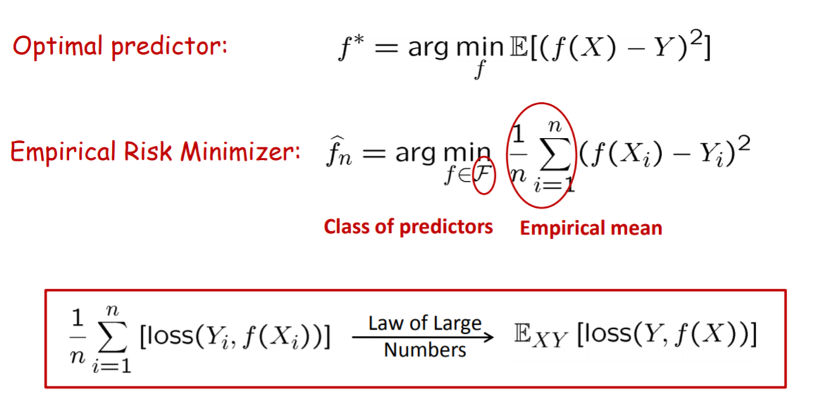 <!-- .element: class="img-500" --> [Machine Learning 10-701/15-781, Fall 2010 Lecture 6: Linear Regression](http://www.cs.cmu.edu/~aarti/Class/10701/slides/Lecture6.pdf) <!-- .element: class="figcaption" -->

***

#### Bayes’ Theorem

 <!-- .element: style="width: 50%" --> [Frequentist And Bayesian Approaches In Statistics](https://www.probabilisticworld.com/frequentist-bayesian-approaches-inferential-statistics/) <!-- .element: class="figcaption" -->

 <!-- .element: style="width: 50%" --> [Calculating Coin Bias With Bayes’ Theorem](https://www.probabilisticworld.com/calculating-coin-bias-bayes-theorem/) <!-- .element: class="figcaption" -->

Note:

https://medium.com/data-science-group-iitr/naive-bayes-unfolded-b2ab036b42b1
https://www.explainxkcd.com/wiki/index.php/795:_Conditional_Risk
https://betterexplained.com/articles/an-intuitive-and-short-explanation-of-bayes-theorem/

https://qph.ec.quoracdn.net/main-qimg-18b90ce3920e0913240c0b5b584e4d19.webp
https://www.quora.com/Do-extraordinary-claims-require-extraordinary-evidence

http://www.labtimes.org/labtimes/method/methods/img/2011_04b.jpg
http://www.labtimes.org/labtimes/method/methods/2011_04.lasso

  <!-- .element: class="img-450" -->

[An Introduction to Likelihoodist, Bayesian, and Frequentist Methods](http://gandenberger.org/2014/07/28/intro-to-statistical-methods-2/)  <!-- .element: class="figcaption" -->

***

#### MLE v.s. MAP

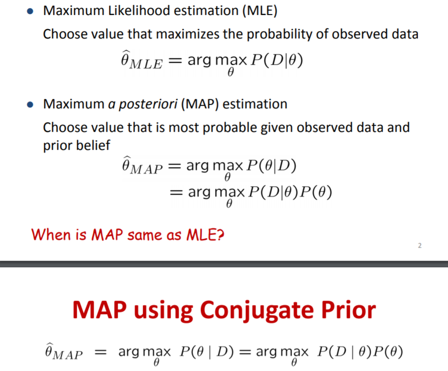 <!-- .element: class="img-450" --> [Machine Learning 10-701/15-781, Fall 2010 Lecture 2](http://www.cs.cmu.edu/~aarti/Class/10701/slides/Lecture2.pdf) <!-- .element: class="figcaption" -->

Maximum Likelihood Estimation v.s. Maximum A Posteriori Estimation  <!-- .element: style="font-size: 24px" -->

[MLE v.s. MAP in ML](https://zhuanlan.zhihu.com/p/32480810) <!-- .element: class="figcaption see-also" -->

***

#### M(C)LE v.s. M(C)AP

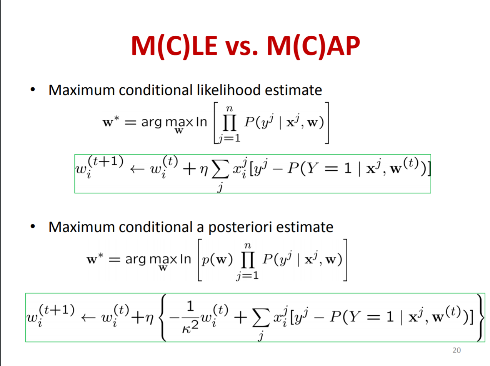 <!-- .element: class="img-500" --> [Machine Learning 10-701/15-781, Fall 2010 Lecture 2](http://www.cs.cmu.edu/~aarti/Class/10701/slides/Lecture2.pdf) <!-- .element: class="figcaption" -->

***

#### Least Squares and MLE

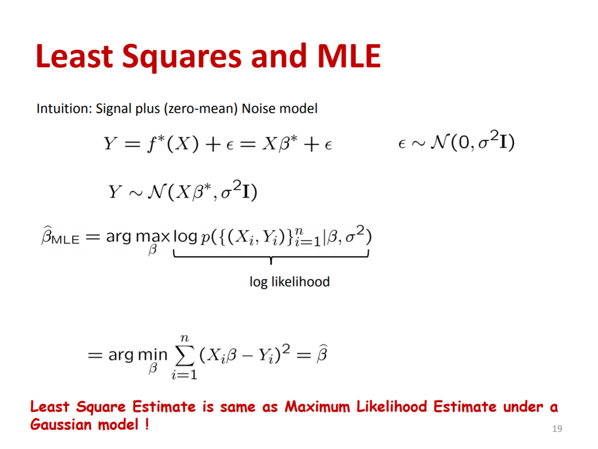 <!-- .element: class="img-450" --> [Machine Learning 10-701/15-781, Fall 2010 Lecture 6: Linear Regression](http://www.cs.cmu.edu/~aarti/Class/10701/slides/Lecture6.pdf) <!-- .element: class="figcaption" -->

Least Square Estimate = Maximum Likelihood Estimate under a Gaussian model. <!-- .element: style="font-size: 24px" -->

Note:

Maximum A Posteriori Estimation

http://www.cs.cmu.edu/~aarti/Class/10701/slides/Lecture2.pdf

***

#### Implementing Linear Regression

<!-- .slide: style="font-size: 32px;" -->

```python
def nn(x, w):
    return x * w
def cost(y, t):
    return ((y - t)**2).sum()

nb_of_samples = 20
x = np.random.uniform(0, 1, nb_of_samples)
t = 3 * x + np.random.normal(0, 0.2, nb_of_samples)

# And then...
```

<p class="fragment current-only" data-code-focus="1-2">
  `$ \boldsymbol{\hat{y}} = X \boldsymbol{w} $`
</p>
<p class="fragment current-only" data-code-focus="3-4">
  `$ \underset{\boldsymbol{w}}{\operatorname{arg\,min}} \, \xi(\hat{y}, t) = {|| \hat{y} - t||_2}^2 $`
</p>
<p class="fragment current-only" data-code-focus="6-8" style="font-size: 24px">
  `$$
    x \sim {\mathcal {U}}(0, 1) \\
    t = 3 x + \varepsilon \\
    \varepsilon \sim N(\mu, \sigma^2) \; \text{with} \; \mu = 0, \sigma = 0.2
  $$`
</p>
<p class="fragment current-only" data-code-focus="10" style="">
  How to optimize?
</p>
---

### Optimization Methods

***

#### Coordinate Descent

 <!-- .element: style="height: 300px; background-color: white" --> [Gradient Descent and Variants - Convergence Rate Summary](http://hduongtrong.github.io/2015/11/23/coordinate-descent/)  <!-- .element: class="figcaption" -->

`$$
  w_{k+1} \gets w_k - \alpha_k \nabla_{i_k} F(w_k) e_{i_k}
$$`

`$$
  \ \ \text{where}\ \ \nabla_{i_k} F(w_k) := \frac{\partial F}{\partial w^{i_k}}(w_k)
$$` <!-- .element: class="fragment" style="font-size: smaller" -->

Note:

`$$ \underset{w}{\operatorname{arg\,min}} \, F : \mathbb{R}^{d} \to \mathbb{R} $$`

$w^{i_k}$ represents the $i_k$-th element of the parameter vector, and $e_{i_k}$ represents the $i_k$-th coordinate vector for some $i_k \in \{1,\dots,d\}$.  In other words, the solution estimates $w_{k+1}$ and $w_k$ differ only in their $i_k$-th element as a result of a move in the $i_k$-th coordinate from $w_k$.

***

#### Gradient Descent (GD)

   <!-- .element: class="img-300" --> [Machine Learning FAQ by Sebastian Raschka](https://sebastianraschka.com/faq/docs/closed-form-vs-gd.html)   <!-- .element: class="figcaption" -->

`$$
\text{Stochastic: }\quad w_{k+1} \gets w_k - \alpha_k \nabla f_{i_k}(w_k)
$$`

`$$
\text{Batch: }\quad  w_{k+1} \gets w_k - \frac{\alpha_k}{n} \sum_{i=1}^n \nabla f_i(w_k)
$$`

***

#### Implementing Linear Regression with GD

<!-- .slide: style="font-size: 32px;" -->

```python
def nn(x, w): return x * w
def cost(y, t): return ((y - t)**2).sum()
nb_of_samples = 20
x = np.random.uniform(0, 1, nb_of_samples)
t = 3 * x + np.random.normal(0, 0.2, nb_of_samples)

def gradient(w, x, t): return 2 * (nn(x, w) - t) * x
def delta_w(w, x, t, learning_rate):
    return learning_rate * gradient(w, x, t).sum()

w = 0.1; learning_rate = 0.1; nb_of_iterations = 10;
w_cost = [(w, cost(nn(x, w), t))]
for i in range(nb_of_iterations):
    w = w - delta_w(w, x, t, learning_rate)
    w_cost.append((w, cost(nn(x, w), t)))
```

<p class="fragment current-only" data-code-focus="1">
  `$ \boldsymbol{\hat{y}} = X \boldsymbol{w} $`
</p>
<p class="fragment current-only" data-code-focus="2">
  `$ \underset{\boldsymbol{w}}{\operatorname{arg\,min}} \, \xi(\hat{y}, t) = {|| \hat{y} - t||_2}^2 $`
</p>
<p class="fragment current-only" data-code-focus="3-5" style="font-size: 24px">
  `$$
    x \sim {\mathcal {U}}(0, 1) \\
    t = 3 x + \varepsilon \\
    \varepsilon \sim N(\mu, \sigma^2) \; \text{with} \; \mu = 0, \sigma = 0.2
  $$`
</p>
<p class="fragment current-only" data-code-focus="7" style="font-size: 24px">
  `$$
      \frac{\partial \xi(\hat{y}, t)}{\partial w} = \frac{\partial \xi}{\partial \hat{y}} \frac{\partial \hat{y}}{\partial w}
    = \frac{\partial (\hat{y} - t)^2}{\partial \hat{y}} \frac{\partial (x w)}{\partial w} \\
    = 2 (\hat{y} - t) x = 2 (x w - t) x
  $$`
</p>
<p class="fragment current-only" data-code-focus="8-9" style="font-size: 24px">
  `$$
    \Delta w = \mu \sum_{i=1}^{N} \frac{\partial \xi_i(\hat{y}_i, t_i)}{\partial w}
  $$`
</p>
<p class="fragment current-only" data-code-focus="11-15" style="">
  `$$
    w_{k+1} \gets w_k - \alpha_k \Delta w
  $$`
</p>

***

<!-- .slide: data-background-iframe="http://nbviewer.jupyter.org/github/peterroelants/peterroelants.github.io/blob/master/notebooks/neural_net_implementation/neural_network_implementation_part01.ipynb" data-background-interactive -->

***

#### Beyond SGD: Noise Reduction and Second-Order Methods

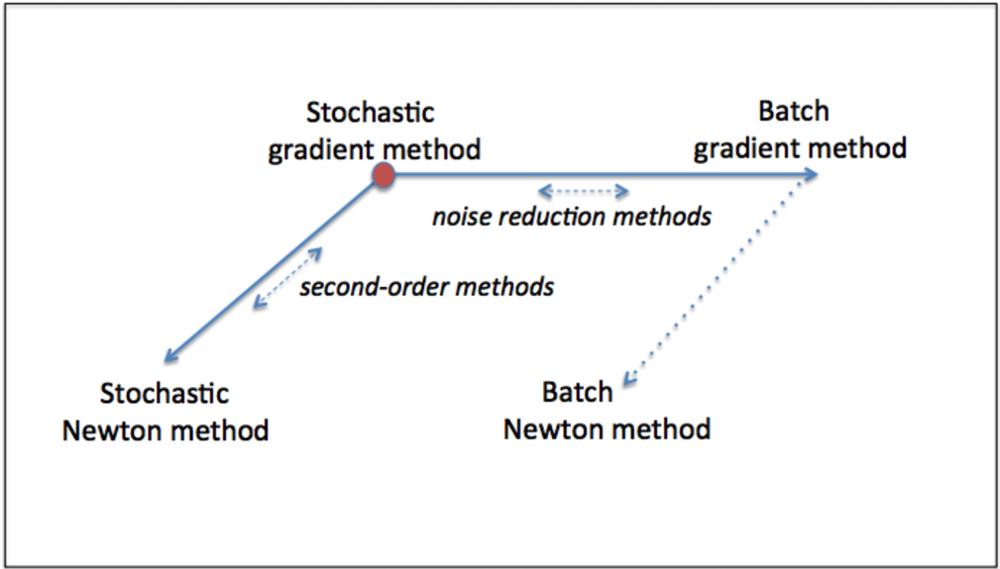 <!-- .element: style="height: 300px" -->

[Optimization Methods for Large-Scale Machine Learning](https://arxiv.org/pdf/1606.04838.pdf) <!-- .element: class="figcaption" -->

***

<!-- .slide: data-background-iframe="https://distill.pub/2017/momentum/" data-background-interactive -->

***

#### Nesterov Momentum

 [CS231n Neural Networks Part 3: Learning and Evaluation](http://cs231n.github.io/neural-networks-3/)  <!-- .element: class="figcaption" -->

***

#### Adam = SDG + Adaptive + Momentum

* [SGD → SGD-M → NAG → AdaGrad → AdaDelta/RMSProp → Adam → Nadam](https://zhuanlan.zhihu.com/p/32230623)
* [Why not just use Adam?](https://zhuanlan.zhihu.com/p/32262540)
* [Adam → SGD](https://zhuanlan.zhihu.com/p/32338983)

***

#### GD Optimization Algorithms: Noisy Moons

 [Alec Radford](https://www.reddit.com/r/MachineLearning/comments/2gopfa/visualizing_gradient_optimization_techniques/cklhott/
)  <!-- .element: class="figcaption" -->

Note:

Comparison of a few optimization methods (animation by Alec Radford). The star denotes the global minimum on the error surface. Notice that stochastic gradient descent (SGD) without momentum is the slowest method to converge in this example.

[Using convolutional neural nets to detect facial keypoints tutorial](http://danielnouri.org/notes/category/machine-learning/#testing-it-out)
[Gradient Descent and Variants - Convergence Rate Summary](http://hduongtrong.github.io/2015/11/23/coordinate-descent/)
[**Test functions for optimization**](https://en.wikipedia.org/wiki/Test_functions_for_optimization)

NAG: Nesterov’s accelerated gradient.

***

#### GD Optimization Algorithms: Long Valley

 [Alec Radford: Visualizing Optimization Algorithms](https://imgur.com/a/Hqolp) <!-- .element: class="figcaption" -->

Note:

Algos without scaling based on gradient information really struggle to break symmetry here - SGD gets no where and Nesterov Accelerated Gradient / Momentum exhibits oscillations until they build up velocity in the optimization direction.

Algos that scale step size based on the gradient quickly break symmetry and begin descent.

http://ruder.io/optimizing-gradient-descent/
http://cs231n.github.io/neural-networks-3/
http://www.cs.toronto.edu/~tijmen/csc321/slides/lecture_slides_lec6.pdf
https://www.quora.com/What-are-differences-between-update-rules-like-AdaDelta-RMSProp-AdaGrad-and-AdaM
https://github.com/robertsdionne/bouncingball
http://blog.mrtz.org/2013/09/07/the-zen-of-gradient-descent.html

***

#### GD Optimization Algorithms: Beale's function

 [Alec Radford: Visualizing Optimization Algorithms](https://imgur.com/a/Hqolp) <!-- .element: class="figcaption" -->

Note:

Due to the large initial gradient, velocity based techniques shoot off and bounce around - AdaGrad almost goes unstable for the same reason.

Algos that scale gradients/step sizes like AdaDelta and RMSProp proceed more like accelerated SGD and handle large gradients with more stability.

https://phyblas.hinaboshi.com/rup/nayuki/2017/e15.gif

***

#### GD Optimization Algorithms: Saddle Point

 [Alec Radford: Visualizing Optimization Algorithms](https://imgur.com/a/Hqolp) <!-- .element: class="figcaption" -->

Note:

Behavior around a saddle point.

NAG/Momentum again like to explore around, almost taking a different path. 

Adadelta/Adagrad/RMSProp proceed like accelerated SGD.

https://phyblas.hinaboshi.com/rup/nayuki/2017/e16.gif

https://nathanbrixius.wordpress.com/2016/07/29/stochastic-and-batch-methods-for-machine-learning/
http://bair.berkeley.edu/blog/2017/08/31/saddle-efficiency/
https://www.slideshare.net/diannepatricia/martin-takac-solving-largescale-machine-learning-problems-in-a-distributed-way
http://andrew.gibiansky.com/blog/machine-learning/hessian-free-optimization/
http://www.cs.toronto.edu/~jmartens/docs/Momentum_Deep.pdf
http://runopti.github.io/blog/2016/07/07/HessianComp/
http://scikit-learn.org/stable/modules/sgd.html

---

### Regulations

***

#### Overfitting

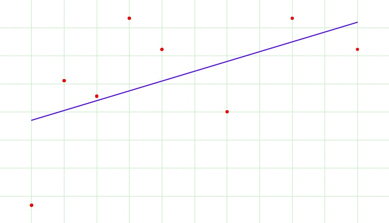

[Over-fitting and Regularization](https://towardsdatascience.com/over-fitting-and-regularization-64d16100f45c)   <!-- .element: class="figcaption" -->

***

#### Outliers: Anscombe's quartet

 [Linear regression From Wikipedia](https://en.wikipedia.org/wiki/Linear_regression) <!-- .element: class="figcaption" -->

***

#### Find Good Compromise

 [Python Machine Learning: Chapter 3 by Sebastian Raschka](http://nbviewer.jupyter.org/github/rasbt/python-machine-learning-book/blob/master/code/ch03/ch03.ipynb)  <!-- .element: class="figcaption" -->

***

#### Vector Norms

`$$ ||x||_p=(\sum_i |x_i|^p)^{1/p} $$`

***

#### Typical Vector Norms

|                 |               |                                      |
|-----------------|---------------|--------------------------------------|
| `$\ell_0$`-Norm | `$ ∣∣x∣∣_0 $` | `$ \#(i \mid x_i \neq 0) $` |
| `$\ell_1$`-Norm | `$ ∣∣x∣∣_1 $` | `$ \sum_i ∣x_i∣ $` |
| `$\ell_2$`-Norm | `$ ∣∣x∣∣_2 $` | `$ \sqrt{\sum_i^{\phantom{n}} ∣x_i∣^2} $` |
| `$\ell_\infty$`-Norm | `$ ∣∣x∣∣_\infty $` | `$ \max_i ∣x_i∣ $` |

[l0-Norm, l1-Norm, l2-Norm, … , l-infinity Norm](https://rorasa.wordpress.com/2012/05/13/l0-norm-l1-norm-l2-norm-l-infinity-norm/)  <!-- .element: class="figcaption see-also" -->

Note:

The L0 norm is the number of non-zero elements in a vector. 

***

#### Typical Vector Norms


[Introduction to Statistical Models and Data Mining
](http://www.stat.ucla.edu/~ybzhao/teaching/stat101c/) <!-- .element: class="figcaption" -->

Note:

- https://www.quora.com/What-is-the-difference-between-L1-and-L2-regularization-How-does-it-solve-the-problem-of-overfitting-Which-regularizer-to-use-and-when
- http://blog.shakirm.com/2016/04/learning-in-brains-and-machines-2/
- https://cnx.org/contents/U4hLPGQD@5/Compressible-signals#uid10
- http://mathworld.wolfram.com/VectorNorm.html


***

#### Regulations

<!-- .slide: style="font-size:smaller" -->

- Ridge: `$$ \underset{w}{min\,} {{|| X w - y||_2}^2 + \alpha {||w||_2}^2} $$`
- Lasso: `$$ \underset{w}{min\,} { \frac{1}{2n_{samples}} ||X w - y||_2 ^ 2 + \alpha ||w||_1} $$`
- Elastic Net:  `$$ \underset{w}{min\,} { \frac{1}{2n_{samples}} ||X w - y||_2 ^ 2 + \alpha \rho ||w||_1 + \frac{\alpha(1-\rho)}{2} ||w||_2 ^ 2} $$`

***

#### Sparsity

| Ridge                                  | Lasso                               |
|----------------------------------------|-------------------------------------|
|  |   |

[Regularization of Generalized Linear Models by Sebastian Raschka](https://rasbt.github.io/mlxtend/user_guide/general_concepts/regularization-linear/) <!-- .element: class="figcaption" -->

[Ridge, Lasso, Group Lasso, Sparse Group Lasso](https://www.zhihu.com/question/38121173/answer/166238142) <!-- .element: class="figcaption see-also" -->

Note:

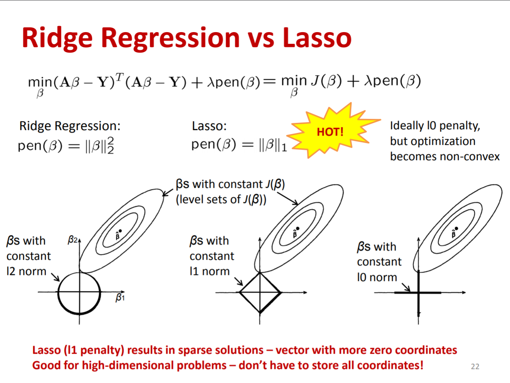  <!-- .element: style="height: 500px" --> [Machine Learning 10-701/15-781, Fall 2010 Lecture 6: Linear Regression](http://www.cs.cmu.edu/~aarti/Class/10701/slides/Lecture6.pdf) <!-- .element: class="figcaption" -->

[What are the main regularization methods used in machine learning? -- Somdeb Sarkhel's answer](https://www.quora.com/What-are-the-main-regularization-methods-used-in-machine-learning/answer/Somdeb-Sarkhel?srid=xQkR)  <!-- .element: class="figcaption see-also" -->

https://stats.stackexchange.com/questions/45643/why-l1-norm-for-sparse-models

***

#### Prior

| Ridge: Gaussian                        | Lasso: Laplace                      |
|----------------------------------------|-------------------------------------|
| 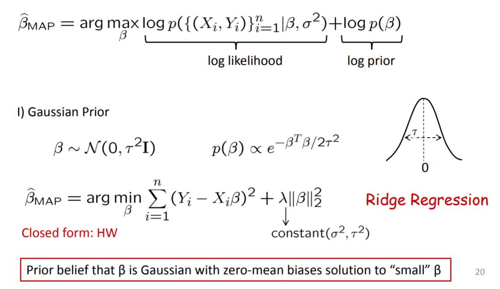        |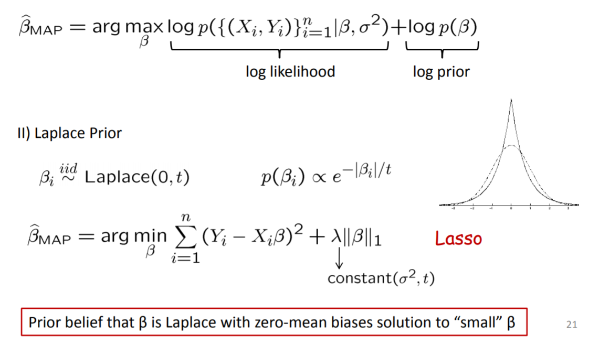      |

[Machine Learning 10-701/15-781, Fall 2010 Lecture 6: Linear Regression](http://www.cs.cmu.edu/~aarti/Class/10701/slides/Lecture6.pdf) <!-- .element: class="figcaption" -->

Note:

https://towardsdatascience.com/the-surprising-longevity-of-the-z-score-a8d4f65f64a0
http://xaktly.com/ProbStat_Distributions.html

---

### Logistic Regression

***

#### Logistic Regression is Linear Classification

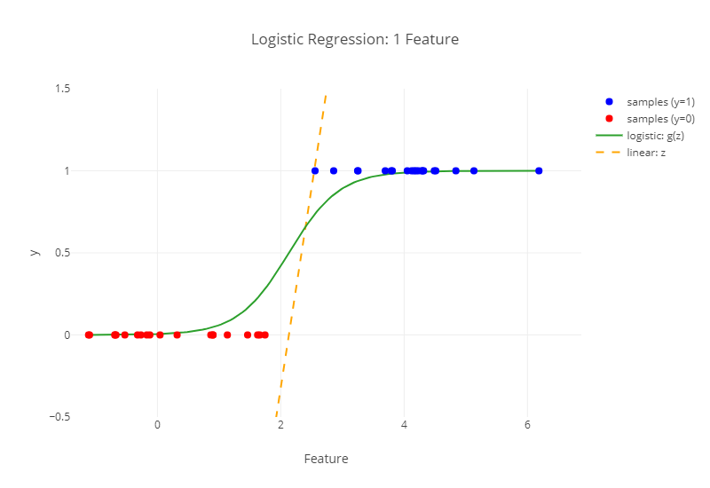 [Logistic Regression – Geometric Intuition](https://florianhartl.com/logistic-regression-geometric-intuition.html)   <!-- .element: class="figcaption" -->

***

#### Logistic Regression is Linear Classification

<iframe width="900" height="800" frameborder="0" scrolling="no" src="//plot.ly/~utensil/1.embed"></iframe>

[Logistic Regression – Geometric Intuition](https://florianhartl.com/logistic-regression-geometric-intuition.html)   <!-- .element: class="figcaption" -->

***

#### Logistic Regression with 2 Features

<iframe width="900" height="800" frameborder="0" scrolling="no" src="//plot.ly/~utensil/3.embed"></iframe>

[Logistic Regression – Geometric Intuition](https://florianhartl.com/logistic-regression-geometric-intuition.html)   <!-- .element: class="figcaption" -->

***

<!-- .slide: style="font-size:smaller" -->

#### Linear Regression v.s. Logistic Regression

 [Gentlest Intro to Tensorflow #4: Logistic Regression](https://medium.com/all-of-us-are-belong-to-machines/gentlest-intro-to-tensorflow-4-logistic-regression-2afd0cabc54)  <!-- .element: class="figcaption" -->

***

#### Linear Regression v.s. Logistic Regression (Cont.)

 [Gentlest Intro to Tensorflow #4: Logistic Regression](https://medium.com/all-of-us-are-belong-to-machines/gentlest-intro-to-tensorflow-4-logistic-regression-2afd0cabc54) <!-- .element: class="figcaption" -->

***

#### Schematic of Logistic Regression

 [Logistic Regression by Sebastian Raschka](http://rasbt.github.io/mlxtend/user_guide/classifier/LogisticRegression/)  <!-- .element: class="figcaption" -->

***

#### Logistic Function ( a.k.a Sigmoid )

 <!-- .element: class="img-300" --> [Activation Functions in Artificial Neural Networks](https://isaacchanghau.github.io/post/activation_functions/)  <!-- .element: class="figcaption" -->

`$$ \sigma(x) = \frac{1}{1+e^{-x}} $$`   <!-- .element: class="fragment current-only" -->

`$$ \hat{y} = \sigma(X \boldsymbol{w}) = \frac{1}{1+e^{-X \boldsymbol{w}}} $$`   <!-- .element: class="fragment current-only" -->

`$$ \hat{y} = \sigma(X \boldsymbol{w}) = \frac{1}{2}(\tanh(X \boldsymbol{w}) + 1)$$`   <!-- .element: class="fragment current-only" -->

Note:

https://stats.stackexchange.com/questions/115258/comprehensive-list-of-activation-functions-in-neural-networks-with-pros-cons
https://www.kdnuggets.com/2016/08/role-activation-function-neural-network.html
https://en.wikipedia.org/wiki/Activation_function

***

#### Hyperbolic Tangent (tanh)

   <!-- .element: class="img-300" -->  [Activation Functions in Artificial Neural Networks](https://isaacchanghau.github.io/post/activation_functions/)  <!-- .element: class="figcaption" -->

`$$
\tanh(x) = \frac{1-e^{-2x}}{1+e^{-2x}} = 2\sigma (2x)-1 
$$`

`$$
\tanh(x) \in (-1, 1) \; \text{while} \; \sigma (x) \in (0,1)
$$`  <!-- .element: class="fragment" -->

note:

- https://stats.stackexchange.com/questions/142348/tanh-vs-sigmoid-in-neural-net
- https://stats.stackexchange.com/questions/101560/tanh-activation-function-vs-sigmoid-activation-function

***

#### Binary Cross-Entropy Loss

   <!-- .element: class="img-300" -->  [TensorFlow and deep learning, without a PhD
](https://codelabs.developers.google.com/codelabs/cloud-tensorflow-mnist/#4)  <!-- .element: class="figcaption" -->

`$$ \xi(y,\hat{y}) = - \sum_{i=1}^{n} \left[ y_i log(\hat{y}_i) + (1-y_i)log(1-\hat{y}_i) \right] $$`

[What's an intuitive way to think of cross entropy?](https://www.quora.com/Whats-an-intuitive-way-to-think-of-cross-entropy/answer/Lili-Jiang)  <!-- .element: class="figcaption see-also" -->

***

<!-- .slide: style="font-size:smaller" -->

#### Impelementing Logistic Regression

```python
def logistic(z): 
    return 1 / (1 + np.exp(-z))

def nn(x, w): 
    return logistic(x.dot(w.T))

def nn_predict(x,w): 
    return np.around(nn(x,w))

def cost(t, y):
    return - np.sum(
      np.multiply(t, np.log(y)) + 
      np.multiply((1-t), np.log(1-y))
    )
```

<p class="fragment current-only" data-code-focus="1-2">
`$$ \sigma(z) = \frac{1}{1+e^{-z}} $$`
</p>
<p class="fragment current-only" data-code-focus="4-5">
`$$ y = \sigma(X \boldsymbol{w}) $$`
</p>
<p class="fragment current-only" data-code-focus="7-8">
`$$ \hat{y} = \left\lfloor y + 0.5 \right\rfloor = -\left\lceil -y - 0.5 \right\rceil $$`

[Wikipedia: Rounding](https://en.wikipedia.org/wiki/Rounding)  <!-- .element: class="figcaption" -->
</p>
<p class="fragment current-only" data-code-focus="10-14">
`$$ \xi(t,\hat{y}) = - \sum_{i=1}^{n} \left[ t_i log(\hat{y}_i) + (1-t_i)log(1-\hat{y}_i) \right] $$`
</p>

***

<!-- .slide: data-background-iframe="http://nbviewer.jupyter.org/github/peterroelants/peterroelants.github.io/blob/master/notebooks/neural_net_implementation/neural_network_implementation_part02.ipynb" data-background-interactive -->

---

### Softmax Regression

***

#### Softmax

`$$ y_c = \varsigma(\mathbf{x})_c = \frac{e^{x_c}}{\sum_{i=1}^C e^{x_i}} \quad \text{for} \; c = 1 \cdots C $$`

where `$ \mathbf{x} , y \in \mathbb{R}^C, y_c \in [0, 1], \sum\limits_{c=1}^C y_c = 1$`

Softmax is a soft version of arg max :  <!-- .element: class="fragment" -->

`$$ \operatorname{arg\,max} ([3, 5, 0]) = [0, 1, 0] $$`  <!-- .element: class="fragment" -->

`$$ \operatorname{softmax} ([3, 5, 0]) \approx [0.12, 0.88, 0] $$`   <!-- .element: class="fragment current-only" -->

`$$ \operatorname{soft\,arg\,max} ([3, 5, 0]) \approx [0.12, 0.88, 0] $$`   <!-- .element: class="fragment current-only" -->

Note:

http://peterroelants.github.io/posts/neural_network_implementation_intermezzo02/
https://www.quora.com/Why-is-softmax-activate-function-called-softmax

***

#### Softmax Predicts Probability

  <!-- .element: class="img-450" -->  [Activation Functions in Artificial Neural Networks](https://isaacchanghau.github.io/2017/05/22/Activation-Functions-in-Artificial-Neural-Networks/)  <!-- .element: class="figcaption" -->

***

#### Schematic of Softmax Regression

  <!-- .element: class="img-450" -->  [Softmax Regression by Sebastian Raschka](http://rasbt.github.io/mlxtend/user_guide/classifier/SoftmaxRegression/)  <!-- .element: class="figcaption" -->

***

#### Cross-Entropy Loss for Softmax

`$$ \underset{\theta}{\operatorname{arg\,max}}\; \mathcal{L}(\theta|\mathbf{t},\mathbf{z}) $$`

`$$ = \underset{\theta}{\operatorname{arg\,min}} \; - log \mathcal{L}(\theta|\mathbf{t},\mathbf{z}) = \xi(\mathbf{t},\mathbf{z}) \\
= - log \prod_{i=c}^{C} y_c^{t_c} = - \sum_{i=c}^{C} t_c \cdot log(y_c) $$`

[How to implement Softmax Classification](http://peterroelants.github.io/posts/neural_network_implementation_intermezzo02/)  <!-- .element: class="figcaption" -->

***

#### Minimizing Cross-Entropy Loss Maximizes the Right Probability

 <!-- .element: class="img-left" -->

 <!-- .element: class="img-right" -->

[Gentlest Introduction to Tensorflow - Part 3](https://www.slideshare.net/KhorSoonHin/gentlest-introduction-to-tensorflow-part-3)   <!-- .element: class="figcaption" -->

Note:

 

***

#### Sigmoid v.s. Softmax

Sigmoid: two-class logistic regression

`$$
\begin{align}
\Pr(Y_i=0) &= \frac{e^{-\boldsymbol\beta \cdot \mathbf{X}_i}} {1 +e^{-\boldsymbol\beta_0 \cdot \mathbf{X}_i}} \, \\
\Pr(Y_i=1) &= 1 - \Pr(Y_i=0) = \frac{1} {1 +e^{-\boldsymbol\beta \cdot \mathbf{X}_i}}
\end{align}
$$`

Softmax: multiple-class logistic regression

`$$ 
\Pr(Y_i=k) = \frac{e^{\boldsymbol\beta_k \cdot \mathbf{X}_i}} {\sum\limits_{0 \leq c \leq K} {e^{\boldsymbol\beta_c \cdot \mathbf{X}_i}}}
$$`

***

<!-- .slide: style="font-size: 80%" -->

#### Implementing Softmax Regression

```python
def softmax_naive(z):
    return np.exp(z) / np.sum(np.exp(z), axis=1, keepdims=True)

def softmax(z):
    # Avoid numerical overflow by removing max
    e = np.exp(z - np.amax(z, axis=1, keepdims=True))
    return e / np.sum(e, axis=1, keepdims=True)
```

<p class="fragment current-only" data-code-focus="1-2">
`$$ 
\Pr(Y_i=k) = \frac{e^{\boldsymbol\beta_k \cdot \mathbf{X}_i}} {\sum\limits_{0 \leq c \leq K} {e^{\boldsymbol\beta_c \cdot \mathbf{X}_i}}}
$$`
</p>
<p class="fragment current-only" data-code-focus="4-7">
`$$ 
\frac{e^{f_{y_i}}}{\sum_j e^{f_j}}
= \frac{Ce^{f_{y_i}}}{C\sum_j e^{f_j}}
= \frac{e^{f_{y_i} + \log C}}{\sum_j e^{f_j + \log C}}
$$`
</p>

***

<!-- .slide: style="font-size: 60%" -->

#### Try it out

```python
>>> z = [
  [30, 60, 90],
  [1, 3, 4.5]
]
>>> softmax_naive(z)
array([[  8.75651076e-27,   9.35762297e-14,   1.00000000e+00],
       [  2.40937683e-02,   1.78030206e-01,   7.97876026e-01]])
>>> np.argmax(softmax_naive(z), axis=1)
array([2, 2], dtype=int64)
>>> np.around(softmax_naive(z))
array([[ 0.,  0.,  1.],
       [ 0.,  0.,  1.]])
>>> softmax(z)
array([[  8.75651076e-27,   9.35762297e-14,   1.00000000e+00],
       [  2.40937683e-02,   1.78030206e-01,   7.97876026e-01]])
>>> np.argmax(softmax(z), axis=1)
array([2, 2], dtype=int64)
>>> np.around(softmax(z))
array([[ 0.,  0.,  1.],
       [ 0.,  0.,  1.]])
```

***

<!-- .slide: style="font-size: 60%" -->

#### Try it out (Cont.)

```python
>>> z = [
  [30, 60, 10000000000000],
  [1, 3, 4.5]
]
>>> softmax_naive(z)
__main__:2: RuntimeWarning: overflow encountered in exp
__main__:2: RuntimeWarning: invalid value encountered in true_divide
array([[ 0.        ,  0.        ,         nan],
       [ 0.02409377,  0.17803021,  0.79787603]])
>>> np.argmax(softmax_naive(z), axis=1)
array([2, 2], dtype=int64)
>>> np.around(softmax_naive(z))
array([[  0.,   0.,  nan],
       [  0.,   0.,   1.]])
>>> softmax(z)
array([[ 0.        ,  0.        ,  1.        ],
       [ 0.02409377,  0.17803021,  0.79787603]])
>>> np.argmax(softmax(z), axis=1)
array([2, 2], dtype=int64)
>>> np.around(softmax(z))
array([[ 0.,  0.,  1.],
       [ 0.,  0.,  1.]])
```

<p class="fragment current-only" data-code-focus="1-14">
  Overflow!
</p>
<p class="fragment current-only" data-code-focus="15-22">
  Numeric stability.

  [CS231n: Softmax classifier](http://cs231n.github.io/linear-classify/#softmax)  <!-- .element: class="figcaption see-also" -->
</p>

---

### SVM

***

#### Support Vector Machine (SVM)

  <!-- .element: style="height: 400px" -->
 [Crash Course on Support Vector Machines](https://www.suchin.co/2017/03/04/The-Support-Vector-Machine/) <!-- .element: class="figcaption" -->

Note:

<iframe width="900" height="800" frameborder="0" scrolling="no" src="//plot.ly/~utensil/5.embed"></iframe>

[Logistic Regression – Geometric Intuition](https://florianhartl.com/logistic-regression-geometric-intuition.html)   <!-- .element: class="figcaption" -->

***

#### SVM: Objective

 [Python Machine Learning: Chapter 3 by Sebastian Raschka](http://nbviewer.jupyter.org/github/rasbt/python-machine-learning-book/blob/master/code/ch03/ch03.ipynb)  <!-- .element: class="figcaption" -->

Note:

The SVM amounts to finding hyperplanes such that `$ w^T_{j}x_i - w^T_{y_i}x_i  - b  \ge \delta \text{   } \forall  \text{   }  j \neq y_i
$` where `$ \delta $` is called the margin. 

***

<!-- .slide: data-background-iframe="http://vision.stanford.edu/teaching/cs231n-demos/linear-classify/" data-background-interactive -->

***

#### SVM: Hinge Loss

`$$
\min_{\mathbf{w}}\ C\underset{Hinge-Loss}{\underbrace{\sum_{i=1}^{n}max[1-y_{i}\underset{h({\mathbf{x}_i})}{\underbrace{(w^{\top}{\mathbf{x}_i}+b)}},0]}}+\underset{l_{2}-Regularizer}{\underbrace{\left\Vert w\right\Vert _{z}^{2}}}
$$`

***

#### SVM: Hinge Loss ( Another Form )

`$$
\underset{w}{min}\ \underset{Hinge-Loss}{\underbrace{\ \sum_{i=1}^n\big(1-y_i \langle x_i,w \rangle\big)_+}} + \lambda\underset{l_{2}-Regularizer}{\underbrace{\parallel w\parallel^2}}
$$`

[A Support Vector Machine in just a few Lines of Python Code](https://maviccprp.github.io/a-support-vector-machine-in-just-a-few-lines-of-python-code/)  <!-- .element: class="figcaption" -->

***

#### SVM: Hinge Loss ( The Derivatives )

`$$
\frac{\partial}{\partial w_k} \lambda\parallel w\parallel^2 \ = 2 \lambda w_k
$$`

`$$
\frac{\partial}{\partial w_k} \big(1-y_i \langle x_i,w \rangle\big)_+ \ = \begin{cases}
    0,                       & y_i \langle x_i,w \rangle\geq 1\\
    -y_ix_{ik},              & \text{otherwise}
\end{cases}
$$`

`$$
\implies \Delta w = \begin{cases}
    2\lambda w - y_ix_i,     & y_i \langle x_i,w \rangle\lt 1\\
    2\lambda w,              & \text{otherwise}
\end{cases}
$$`

[A Support Vector Machine in just a few Lines of Python Code](https://maviccprp.github.io/a-support-vector-machine-in-just-a-few-lines-of-python-code/)  <!-- .element: class="figcaption" -->

***

#### Hinge Loss is "Soft" Zero-One Loss

 <!-- .element: class="img-450" --> [Machine Learning CS4780/CS5780: Empirical Risk Minimization](http://www.cs.cornell.edu/courses/cs4780/2015fa/page4/index.html)  <!-- .element: class="figcaption" -->

***

#### Soft margin SVM

  [In layman's terms, how does SVM work?](https://www.quora.com/In-laymans-terms-how-does-SVM-work/answer/Prasoon-Goyal?srid=xQkR)  <!-- .element: class="figcaption" -->

***

#### Kernel Functions in SVM

 [
Rahul Agarwal's Answer: What are kernels in machine learning and SVM and why do we need them?](https://www.quora.com/What-are-kernels-in-machine-learning-and-SVM-and-why-do-we-need-them/answer/Rahul-Agarwal-10?srid=xQkR) <!-- .element: class="figcaption" -->

Note:

https://www.quora.com/In-laymans-terms-how-does-SVM-work/answer/Prasoon-Goyal
https://www.quora.com/What-is-a-radial-basis-function
[Kernel Methods for Deep Learning](http://cseweb.ucsd.edu/~saul/papers/nips09_kernel.pdf)
https://isaacchanghau.github.io/2017/08/04/%E6%9C%BA%E5%99%A8%E5%AD%A6%E4%B9%A0-%E5%91%A8%E5%BF%97%E5%8D%8E-%E5%AD%A6%E4%B9%A0%E7%AC%94%E8%AE%B0-3/

***

#### Kernel Functions in SVM

- Linear: `$ K(x, y) = x^\top y $`
- Polynomial: `$ K(x, y) = (x^\top y + 1)^d $`
- Sigmoid: `$ K(x, y) = tanh(a x^\top y + b) $`
- Radial basis func(RBF): `$ K(x, y) = \exp(-\gamma \| x - y\|^2) $`

[How do I select SVM kernels?](https://www.quora.com/How-do-I-select-SVM-kernels/answer/Prasoon-Goyal)  <!-- .element: class="figcaption" -->

***

<!-- .slide: style="font-size: 60%" -->

#### Implementing SVM

```python
x = np.array([[-2,4,-1], [4,1,-1], [1, 6, -1], [2, 4, -1], [6, 2, -1]])
t = np.array([-1, -1, 1, 1, 1])
learning_rate = 1; nb_of_iterations = 100000; n_samples, n_features = x.shape; w = np.zeros(n_features)

def nn(x, w): return np.sign(np.dot(x, w)).astype(int)
def cost(w, x, t, ld): return max(1 - t * np.dot(x, w), 0) + ld * (np.linalg.norm(w, ord=2) ** 2)
def is_misclassified(w, x, t): return (t * np.dot(x, w) < 1).astype(int)
def gradient(w, x, t, ld): return 2 * ld * w - x * t * is_misclassified(w, x, t)

# costs = []
for epoch in range(1, nb_of_iterations):
    ld = 1 / epoch; error = 0
    for i, x_ in enumerate(x):              
        w = w - learning_rate * gradient(w, x[i], t[i], ld)
        # if is_misclassified(w, x[i], t[i]): error = 1
        error = cost(w, x[i], t[i], ld)
    # costs.append(error)
```

<p class="fragment current-only" data-code-focus="1-2">
  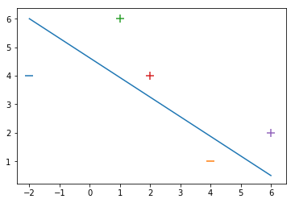 <!-- .element: class="img-code" -->
  Data points.
</p>
<p class="fragment current-only" data-code-focus="3">
  Parameter initialization.
</p>
<p class="fragment current-only" data-code-focus="5">
  `$$
  \operatorname{sgn}(w^{\top} \mathbf{x}) = \begin{cases}
      +1,     & \text{Positive} \\
      -1,    & \text{Negative}
  \end{cases}
  $$`
</p>
<p class="fragment current-only" data-code-focus="6">
  `$$
  \min_{\mathbf{w}}\ C\underset{Hinge-Loss}{\underbrace{\sum_{i=1}^{n}max[1-y_{i}\underset{h({\mathbf{x}_i})}{\underbrace{(w^{\top}{\mathbf{x}_i}+b)}},0]}}+\underset{l_{2}-Regularizer}{\underbrace{\left\Vert w\right\Vert _{z}^{2}}}
  $$`
</p>
<p class="fragment current-only" data-code-focus="7-8">
  `$$
  \Delta w = \begin{cases}
      2\lambda w - y_ix_i,     & y_i \langle x_i,w \rangle\lt 1\\
      2\lambda w,              & \text{otherwise}
  \end{cases}
  $$`
</p>
<p class="fragment current-only" data-code-focus="10-17">
  Training.

  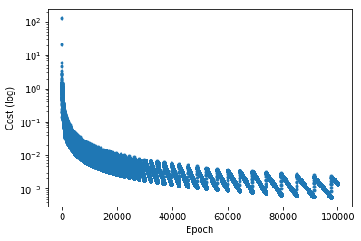 <!-- .element: class="img-code" -->
</p>

Note:

```python
def cost(y, t, w, ld): return is_misclassified(w, x, t) + ld * (np.linalg.norm(w, ord=2) ** 2)
```

***

<!-- .slide: style="font-size:24px; text-align: left" -->

#### SVM: Pros and Cons

Pros:

- Effective when 
  - `$ D_\text{features} $` is high-dimensional
  - `$ D_\text{features} \gt N_\text{samples}$`
- Memory Efficient:
  - uses support vectors in the decision function -- a subset of training points
- Versatile:
  - different Kernel functions can be specified for the decision function.

Cons:

- `$ D_\text{features} \gg N_\text{samples}$`
  - Over-fitting
  - Choosing Kernel `$ \phi(x, y) $`and Regularization `$ C $` is crucial 
- No probability estimates
  - Except using an expensive k-fold CV.
- Complexity:
  - `$ \mathcal{O}(D_\text{features} N_\text{samples}^{2 \sim 3}) $`

[scikit-learn User Guide: Support Vector Machines](http://scikit-learn.org/stable/modules/svm.html)  <!-- .element: class="figcaption" -->

---

### Tree Based Learning Algorithms

***

#### Tree

 [A Complete Tutorial on Tree Based Modeling from Scratch (in R & Python)](https://www.analyticsvidhya.com/blog/2016/04/complete-tutorial-tree-based-modeling-scratch-in-python/) <!-- .element: class="figcaption" -->

***

#### Decision Trees

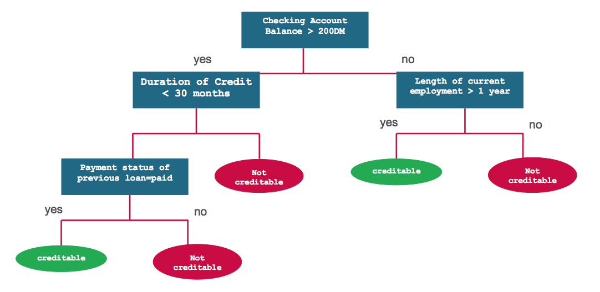 [A Practical Guide to Tree Based Learning Algorithms](https://sadanand-singh.github.io/posts/treebasedmodels/) <!-- .element: class="figcaption" -->

***

#### Decision Trees with Details

   <!-- .element: style="height: 450px" --> [scikit-learn User Guide: Decision Trees](http://scikit-learn.org/stable/modules/tree.html)   <!-- .element: class="figcaption" -->

***

#### Decision Surface

 [Machine Learning Methods: Decision trees and forests](http://efavdb.com/notes-on-trees/) <!-- .element: class="figcaption" -->

***

#### Decision surface of a decision tree on the iris dataset

 <!-- .element: style="height: 450px" --> [scikit-learn User Guide: Plot the decision surface of a decision tree on the iris dataset](http://scikit-learn.org/stable/auto_examples/tree/plot_iris.html)   <!-- .element: class="figcaption" -->

***

#### Decision Tree Regression 

  <!-- .element: style="height: 450px" --> [scikit-learn User Guide: Decision Tree Regression](http://scikit-learn.org/stable/auto_examples/tree/plot_tree_regression.html)   <!-- .element: class="figcaption" -->

***

<!-- .slide: data-background-iframe="http://www.r2d3.us/visual-intro-to-machine-learning-part-1/" data-background-interactive -->

***

#### Tree algorithms

<table style="width: 80%; overflow-y: scroll">
  <tr>
    <th>Algorithm</th>
    <th>Features</th> 
  </tr>
  <tr>
    <td>ID3 <small>(Iterative Dichotomiser 3)</small></td>
    <td style="font-size: 24px">
- categorical feature <br />
- yield the largest information gain  <br />
- a pruning step is usually applied for generalization  <br />
    </td>
    </tr>
    <tr class="">
    <td>C4.5</td>
    <td style="font-size: 24px">
- supports numerical variables by partitioning into a discrete set of intervals  <br />
- converts the trained trees into sets of if-then rules  <br />
- pruning by removing precondition
    </td>
    </tr>
    <!-- <tr class="">
    <td>C5.0</td>
    <td style="font-size: 24px">
- proprietary  <br />
- less memory  <br />
- smaller rulesets  <br />
- more accurate  <br />
    </td>
    </tr> -->
    <tr class="">
    <td>CART <small>(Classification and Regression Trees)</small></td>
    <td style="font-size: 24px">
- similar to C4.5  <br />
- supports numerical target variables (regression)  <br />
- does not compute rule sets  <br />
    </td>
    </tr>
</table>

note:

- [Top 10 algorithms in data mining](http://www.cs.uvm.edu/~icdm/algorithms/10Algorithms-08.pdf)

***

<!-- .slide: style="font-size:24px;" -->

#### Gini Index VS Information Gain

| Algorithm / <br /> Split Criterion       	| Description	 | Tree Type |
|-------------------------------------------|--------------|-----------|
| Gini Split / <br /> Gini Index	          | Favors larger partitions. <br /> Very simple to implement.	 | CART |
| Information Gain / <br /> Entropy        	| Favors partitions that have small counts <br /> but many distinct values. |	 ID3 / C4.5 |

[A Complete Tutorial on Tree Based Modeling from Scratch (in R & Python)](https://www.analyticsvidhya.com/blog/2016/04/complete-tutorial-tree-based-modeling-scratch-in-python/)  <!-- .element: class="figcaption see-also" -->

note:

[Decision-Tree Learning](http://www.ke.tu-darmstadt.de/lehre/archiv/ws0809/mldm/dt.pdf)

***

<!-- .slide: data-background-iframe="http://www.learnbymarketing.com/481/decision-tree-flavors-gini-info-gain/" data-background-interactive -->

***

<!-- .slide: data-background-iframe="//nbviewer.jupyter.org/github/josiahdavis/DecisionTrees/blob/master/DecisionTrees.ipynb" data-background-interactive -->

***

<!-- .slide: data-background-iframe="//nbviewer.jupyter.org/github/gregtam/interpreting-decision-trees-and-random-forests/blob/master/Interpreting%20Decision%20Trees%20and%20Random%20Forests.ipynb" data-background-interactive -->

***

<!-- .slide: data-background-iframe="http://gabrielelanaro.github.io/blog/2016/03/03/decision-trees.html" data-background-interactive -->

***

<!-- .slide: data-background-iframe="http://gabrielelanaro.github.io/blog/2016/03/03/decision-trees.html" data-background-interactive -->

***

<!-- .slide: data-background-iframe="https://machinelearningmastery.com/implement-decision-tree-algorithm-scratch-python/" data-background-interactive -->

***

#### Learning with ensembles

***

#### Bagging

 <!-- .element: class="img-450" --> [Python Machine Learning: Chapter 7 by Sebastian Raschka](http://nbviewer.jupyter.org/github/rasbt/python-machine-learning-book/blob/master/code/ch07/ch07.ipynb)  <!-- .element: class="figcaption" -->

***

#### Adaptive Boosting

 <!-- .element: class="img-450" --> [Python Machine Learning: Chapter 7 by Sebastian Raschka](http://nbviewer.jupyter.org/github/rasbt/python-machine-learning-book/blob/master/code/ch07/ch07.ipynb)  <!-- .element: class="figcaption" -->

***

#### Random Forests


[What are the differences between bagged trees and random forests? - Prashanth Ravindran's answer](https://www.quora.com/What-are-the-differences-between-bagged-trees-and-random-forests/answer/Prashanth-Ravindran)  <!-- .element: class="figcaption" -->

[Python Machine Learning: Chapter 10 by Sebastian Raschka](http://nbviewer.jupyter.org/github/rasbt/python-machine-learning-book/blob/master/code/ch10/ch10.ipynb#Random-forest-regression)  <!-- .element: class="figcaption see-also" -->

***

####  Level-wise and leaf-wise growth


[LightGBM and XGBoost Explained](http://mlexplained.com/2018/01/05/lightgbm-and-xgboost-explained/)  <!-- .element: class="figcaption" -->

***

#### XGBoost

- Introduction to Boosted Trees
  - [doc](https://xgboost.readthedocs.io/en/latest/tutorials/model.html)
  - [slide](https://homes.cs.washington.edu/~tqchen/pdf/BoostedTree.pdf)
- [A Gentle Introduction to XGBoost for Applied Machine Learning](https://machinelearningmastery.com/gentle-introduction-xgboost-applied-machine-learning/)
- [gradient boosting decision tree algorithm](https://en.wikipedia.org/wiki/Gradient_boosting)
- [XGBoost: A Scalable Tree Boosting System](https://arxiv.org/abs/1603.02754)
- [Awesome XGBoost](https://github.com/dmlc/xgboost/tree/master/demo)

***

#### Gradient Boosting is like Golf

 <!-- .element: class="img-450" -->

[How to explain gradient boosting](http://explained.ai/gradient-boosting/index.html)  <!-- .element: class="figcaption" -->

note:

- [Gradient Boosting from scratch](https://medium.com/mlreview/gradient-boosting-from-scratch-1e317ae4587d)
- [What is an intuitive explanation of Gradient Boosting? - Charles Vr's answer](https://www.quora.com/What-is-an-intuitive-explanation-of-Gradient-Boosting/answer/Charles-Vr)

***

<!-- .slide: style="font-size:32px;" -->

| Gradient descent | Gradient boosting |
|------------------|-------------------|
| `$ \vec w_t = \vec w_{t-1} - \eta \nabla f(\vec w_{t-1}) $` | `$\hat{\vec y}_m = \hat{\vec y}_{m-1} + \eta (- \nabla L(\vec y, \hat{\vec y}_{m-1}))$` |

[How to explain gradient boosting](http://explained.ai/gradient-boosting/index.html)  <!-- .element: class="figcaption" -->

[GBDT v.s. XGBoost](https://www.zhihu.com/question/41354392/answer/98658997)   <!-- .element: class="figcaption see-also" -->

***

<!-- .slide: data-background-iframe="//nbviewer.jupyter.org/github/Vooban/Decision-Trees-For-Knowledge-Discovery/blob/master/Decision-Trees-For-Knowledge-Discovery-With-XGBoost.ipynb" data-background-interactive -->

***

<!-- .slide: style="font-size:28px;" -->

#### Higgs Boson ML Challenge

- [Starting kit for the Higgs boson machine learning challenge](http://nbviewer.jupyter.org/urls/www.lri.fr/~kegl/HiggsML/StartingKit/startingKitHiggsKegl.ipynb)
- XGBoost
  - [Winning solution of Kaggle Higgs competition: what a single model can do?](https://no2147483647.wordpress.com/2014/09/17/winning-solution-of-kaggle-higgs-competition-what-a-single-model-can-do/)
  - [Higgs Boson Discovery with Boosted Trees](http://proceedings.mlr.press/v42/chen14.pdf)
- DL
  - [Classification of Higgs Boson Tau-Tau decays using GPU accelerated Neural Networks](http://cs229.stanford.edu/proj2015/017_report.pdf)
  - [Identifying the Higgs Boson with Convolutional Neural Networks](http://cs231n.stanford.edu/reports/2016/pdfs/300_Report.pdf)
  - [Searching for higgs boson decay modes with deep learning](https://www.researchgate.net/publication/287742463_Searching_for_higgs_boson_decay_modes_with_deep_learning)
  - [Searching for Exotic Particles in High-Energy Physics with Deep Learning](https://arxiv.org/pdf/1402.4735.pdf)

Note:

- [Dataset permanently released at CERN](https://www.kaggle.com/c/higgs-boson/discussion/13143)
  - [Data](http://opendata.cern.ch/record/329)

***

<!-- .slide: data-background-iframe="//nbviewer.jupyter.org/github/utensil/julia-playground/blob/master/dl/hello_higgs.ipynb" data-background-interactive -->

---

### Nearest Neighbors

***

#### K-nearest Neighbors

   <!-- .element: class="img-450" --> [Python Machine Learning: Chapter 3 by Sebastian Raschka](http://nbviewer.jupyter.org/github/rasbt/python-machine-learning-book/blob/master/code/ch03/ch03.ipynb)  <!-- .element: class="figcaption" -->

***

#### Nearest Neighbors Classification

  <!-- .element: class="img-left" -->

  <!-- .element: class="img-right" -->

[scikit-learn User Guide: Nearest Neighbors Classification Example](http://scikit-learn.org/stable/auto_examples/neighbors/plot_classification.html)  <!-- .element: class="figcaption" -->

***

#### Nearest Neighbors Regression


[scikit-learn User Guide: Nearest Neighbors regression Example](http://scikit-learn.org/stable/auto_examples/neighbors/plot_classification.html)  <!-- .element: class="figcaption" -->


***

#### Nearest Centroid Classification

  <!-- .element: style="float:left; width: 49%" -->

  <!-- .element: style="float:right; width: 49%" -->

[Text and text stream mining tutorial](https://www.slideshare.net/mgrcar/text-and-text-stream-mining-tutorial-15137759)  <!-- .element: class="figcaption" -->

***

#### Nearest Neighbor Algorithms

<table style="width: 80%; overflow-y: scroll; font-size: 28px">
  <tr>
    <th>Algorithm</th>
    <th>Complexity</th> 
  </tr>
  <tr>
    <td>Brute Force</td>
    <td>`$ \mathcal{O}(D_\text{features} N_\text{samples}^2) $`</td>
  </tr>
  <tr class="">
    <td>K-D Tree</td>
    <td>`$ \begin{cases} \mathcal{O}( D_\text{features} \log{N_\text{samples}} ) & \mbox{if } D_\text{features} \sim 20 \\[1ex] \mathcal{O}(D_\text{features} N_\text{samples}) & \mbox{if } D_\text{features} \gg 20 \end{cases} $`</td>
  </tr>
  <tr class="">
    <td>Ball Tree</td>
    <td>`$ \mathcal{O}( D_\text{features} \log{N_\text{samples} )} $`</td>
  </tr>
</table>

***

<!-- .slide: data-background-iframe="http://vision.stanford.edu/teaching/cs231n-demos/knn/" data-background-interactive -->

---

### Other Probability Related Methods

***

#### Bayes’ theorem

`$$
\mbox{posterior} = \frac{\mbox{prior} \times \mbox{likelihood}}{\mbox{evidence}}
$$`

`$$
P(y \mid x_1, \dots, x_n) = \frac{P(y) \times P(x_1, \dots x_n \mid y)} {P(x_1, \dots, x_n)}
$$`

***

#### Naive Bayes

Using Naive independence assumption:

`$$
P(x_i | y, x_1, \dots, x_{i-1}, x_{i+1}, \dots, x_n) = P(x_i | y)
$$`

`$$
P(y \mid x_1, \dots, x_n) = \frac{P(y) \times \prod_{i=1}^{n} P(x_i \mid y)} {P(x_1, \dots, x_n)}
$$`   <!-- .element: class="fragment current-only" -->

`$$
P(y \mid x_1, \dots, x_n) \propto P(y) \prod_{i=1}^{n} P(x_i \mid y) 
$$`   <!-- .element: class="fragment current-only" -->

`$$
\hat{y} = \arg\max_y P(y) \prod_{i=1}^{n} P(x_i \mid y)
$$`   <!-- .element: class="fragment" -->

Note:

https://en.wikipedia.org/wiki/Naive_Bayes_classifier
https://stackoverflow.com/questions/10059594/a-simple-explanation-of-naive-bayes-classification

***

[Remove Stepwise Regression and Bayes Regression for now](https://github.com/utensil/slides/commit/9b78364e0c5dff3c2ffee056c60039ac6d0ff6bf#diff-37928793727600d98cc6e6c8a0075033)

***

### [Principal Component Analysis (PCA)](https://en.wikipedia.org/wiki/Principal_component_analysis)

***

<!-- .slide: data-background-iframe="https://nbviewer.jupyter.org/github/tirthajyoti/PythonMachineLearning/blob/master/Principal%20Component%20Analysis.ipynb" data-background-interactive -->

***

<!-- .slide: style="font-size:36px; text-align: left" -->

####  Gaussian process (GP)

A GP is the generalization of a Gaussian distribution to a distribution over functions, instead of random variables.

Just as a Gaussian distribution is completely specified by its mean `$ \mu $` and variance `$ \sigma $`, 

a GP is completely specified by its **mean function** `$ m(x) $`, and covariance function `$ k(x,x′) $`.

***

#### Gaussian Process Classification (GPC) on Iris dataset


[scikit-learn User Guide: Gaussian process classification (GPC) on iris dataset](http://scikit-learn.org/stable/auto_examples/neighbors/plot_nearest_centroid.html)  <!-- .element: class="figcaption" -->

---

### Cross Validation etc.

***

#### Combining transformers and estimators in a pipeline

 [Python Machine Learning: Chapter 6 by Sebastian Raschka](http://nbviewer.jupyter.org/github/rasbt/python-machine-learning-book/blob/master/code/ch06/ch06.ipynb)  <!-- .element: class="figcaption" --> 

***

#### The holdout method

 [Python Machine Learning: Chapter 6 by Sebastian Raschka](http://nbviewer.jupyter.org/github/rasbt/python-machine-learning-book/blob/master/code/ch06/ch06.ipynb)  <!-- .element: class="figcaption" --> 

***

#### K-fold cross-validation

 [Python Machine Learning: Chapter 6 by Sebastian Raschka](http://nbviewer.jupyter.org/github/rasbt/python-machine-learning-book/blob/master/code/ch06/ch06.ipynb)  <!-- .element: class="figcaption" --> 

***

#### Algorithm selection with nested cross-validation

 [Python Machine Learning: Chapter 6 by Sebastian Raschka](http://nbviewer.jupyter.org/github/rasbt/python-machine-learning-book/blob/master/code/ch06/ch06.ipynb)  <!-- .element: class="figcaption" -->

***

#### An example of CV

- [train_captcha.py](https://github.com/utensil/julia-playground/blob/master/dl/train_captcha.py)
  - [How can I use Keras with datasets that don't fit in memory?](https://keras.io/getting-started/faq/#how-can-i-use-keras-with-datasets-that-dont-fit-in-memory)
  - [How to batch train with fit_generator()?](https://github.com/fchollet/keras/issues/7729)
  - [Cross Validation in Keras](https://github.com/fchollet/keras/issues/1711)
  - [keras/scikit-learn: using fit_generator() with cross validation](https://stackoverflow.com/questions/40854232/keras-scikit-learn-using-fit-generator-with-cross-validation)
  - [How to pass callbacks to scikit_learn wrappers (e.g. KerasClassifier)](https://github.com/fchollet/keras/issues/4278#issuecomment-264665803)

***

#### Learning Rates

 [CS231n Neural Networks Part 3: Learning and Evaluation](http://cs231n.github.io/neural-networks-3/)  <!-- .element: class="figcaption" -->

***

#### Training/Validation accuracy

 [CS231n Neural Networks Part 3: Learning and Evaluation](http://cs231n.github.io/neural-networks-3/)  <!-- .element: class="figcaption" -->

***

#### Correlation

- [Correlation and dependence](https://en.wikipedia.org/wiki/Correlation_and_dependence)
- [IV (Instrumental variables) estimation](https://en.wikipedia.org/wiki/Instrumental_variables_estimation)

***

#### Hyperparameter Optimization 

- [Overfitting, Regularization, and Hyperparameters](https://dswalter.github.io/overfitting-regularization-hyperparameters.html)
- [Common Problems in Hyperparameter Optimization](https://blog.sigopt.com/posts/common-problems-in-hyperparameter-optimization)
- [scikit-optimize](https://scikit-optimize.github.io/)
https://thuijskens.github.io/2016/12/29/bayesian-optimisation/
- [Bayesian optimization with scikit-learn](https://github.com/thuijskens/bayesian-optimization)
- [Overfitting in Machine Learning: What It Is and How to Prevent It](https://elitedatascience.com/overfitting-in-machine-learning#how-to-prevent)
- [sklearn.model_selection: Model Selection](http://scikit-learn.org/stable/modules/classes.html#module-sklearn.model_selection)
